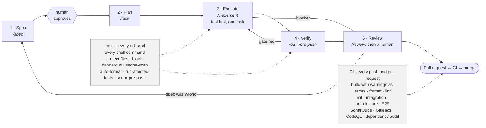

<div align="center">


# Agentic Full-Stack Boilerplate

**A .NET 10 + Angular 21 starting point that ships with its own engineering guardrails.**

[](https://dotnet.microsoft.com/)
[](https://angular.dev/)
[](https://nx.dev/)
[](https://primeng.org/)
[](https://learn.microsoft.com/ef/core/)
[](#licence)

</div>

---

## What this is

Most "starter templates" give you a folder structure and leave the hard parts — layering that
actually holds, an API contract the frontend can trust, a quality gate that blocks bad merges,
infrastructure you can read — as an exercise. This one ships those parts working, with a sample
entity proving the whole path end to end.

It is also built to be driven by [Claude Code](https://claude.com/claude-code). A `.claude/`
harness ships **committed, not gitignored**: hooks that format on save, block dangerous shell
commands, protect sensitive files, run the affected tests, scan for secrets, and gate a push on
the quality gate — plus slash commands for the recurring work.

It contains **no business domain**. The sample entity, `Item`, is designed to be deleted on your
first day. The other module that ships — the ["What's new" feature spotlight](docs/whats-new.md)
— is not a sample and is meant to stay: it is domain-free plumbing every product ends up wanting.

## Why it exists

Every new service re-litigates the same decisions: where do business rules live, what shape is
an error response, who owns the API contract, what blocks a merge, how do we get to two clouds
without forking the codebase. Those decisions are made here, written down as
[ADRs](docs/adr/), and enforced by tests and CI rather than by convention.

## What you get

- **Layered Clean Architecture backend** — `Domain` → `Application` → `Contracts` →
  `Infrastructure` → `Api`, with an architecture test suite that fails the build when the
  dependency direction is violated.
- **A consistent API envelope** — every response is `ApiResponse<T>` with a stable
  machine-readable `code`, a `traceId`, and a documented status-code contract. Exceptions map
  to responses through a handler chain, not through try/catch in controllers.
- **OpenAPI as the contract** — the frontend's TypeScript types are *generated* from the API's
  OpenAPI document. Hand-written DTOs on the client are a bug. See [docs/api/](docs/api/).
- **Angular 21 + Nx + PrimeNG** — standalone components, signals, `OnPush`, strict TypeScript,
  library boundaries enforced by Nx tags, PrimeNG as the only component library.
- **A "What's new" feature spotlight** — a popup that shows each user a newly shipped feature
  exactly once, the first time they land on a URL prefix it is bound to. Acknowledgement is
  server-side per user, so it survives cleared browser storage and other devices, and several
  pending announcements chain into one carousel. Shipping the next one is an INSERT-only
  migration and no code at all. See [docs/whats-new.md](docs/whats-new.md).
- **EF Core migration workflow** — MSSQL, migration-based, with two migrations in the box
  (`InitialCreate` and `AddFeatureAnnouncements`) so the workflow is demonstrated rather than
  described.
- **Two clouds, one switch** — `CLOUD_PROVIDER=gcp|azure` selects the secrets provider and the
  identity issuer at the composition root, and selects which `infra/` tree deploys. Terraform
  for GCP, Bicep for Azure, provisioning the same logical shape.
- **A real quality gate** — build with warnings as errors, `dotnet format` verification, ESLint,
  unit + integration + architecture tests, Playwright E2E, SonarQube (zero new
  Blocker/Critical/Major, ≥80% coverage on new code), Gitleaks, CodeQL, dependency
  vulnerability scanning, and container image scanning with an SBOM for each image —
  because most of a deployed image was never in this repository.
- **The agentic harness** — 8 hooks and the `/spec`, `/task`, `/qa`, `/review`, `/implement`,
  `/pre-push`, `/quality-gate`, `/new-migration`, `/sync` commands, all committed.
- **A written process** — a [five-stage workflow](docs/workflow.md), a
  [Definition of Done](docs/definition-of-done.md), a [spec template](docs/specs/TEMPLATE.md),
  and a [Day-1 onboarding checklist](docs/onboarding.md).
- **An architecture guide that matches the code** — [docs/architecture.md](docs/architecture.md)
  walks every backend layer and every frontend library: what may and may not live there, what it
  depends on, the rule the architecture tests actually enforce, a real example from the sample
  slice, and the mistake newcomers make with it.

What it is **not**: a platform, a CMS, an auth server, or a deployment you can apply as-is.
`infra/` ships as reviewed IaC with no state and no real project identifiers — you configure a
state backend and your own values before the first `apply`.

## Quickstart

### The whole stack, one command

**Prerequisites:** Docker. That is the entire list.

```bash
git clone https://github.com/<your-org>/aj-boilerplate-fs.git
cd aj-boilerplate-fs

cp .env.example .env          # then set MSSQL_SA_PASSWORD; nothing else is required
docker compose up --build
```

That builds and starts SQL Server, Redis, the API, and the web app, applies the EF Core
migrations as a discrete step before the API starts, and puts nginx in front of the SPA
proxying `/api` to the backend — same-origin, exactly as a deployed environment behind one
hostname would be.

| | |
|---|---|
| Web app | <http://localhost:4200> |
| API | <http://localhost:8080> |
| OpenAPI UI | <http://localhost:8080/swagger> |
| Readiness probe | <http://localhost:8080/health/ready> |

```bash
docker compose down       # stop, keeping the database volume
docker compose down -v    # stop and destroy the local data
```

Already running SQL Server or Redis on this machine? Every published port has an override:
set `DB_PORT`, `REDIS_PORT`, `API_PORT`, or `WEB_PORT` in `.env`. Only the host side moves —
the containers keep talking to each other on their own network, so nothing else changes.

`.env.example` documents every environment variable this repository reads, what each is
for, and whether it is required. `src/backend/docker-compose.yml` and
`src/frontend/docker-compose.yml` still exist for working on one stack while running the
other some other way — they join an external `app-net` network you create yourself. Do not
run them alongside the root file; they publish the same ports.

### Or run the toolchains directly (about 5 minutes)

**Prerequisites:** .NET SDK 10, Node.js 22+, a reachable SQL Server and Redis, and a Keycloak
realm if you want authorization enforced locally.

```bash
# 1 — clone
git clone https://github.com/<your-org>/aj-boilerplate-fs.git
cd aj-boilerplate-fs

# 2 — configure. Export what the API needs, or put it in a local .env — either way
#     nothing here is committed; .gitignore already excludes .env and .env.*
export CLOUD_PROVIDER=gcp          # or: azure
export ConnectionStrings__Default='Server=localhost,1433;Database=AjBoilerplate;User Id=sa;Password=<your-local-password>;TrustServerCertificate=True;'
export ConnectionStrings__Redis='localhost:6379'

# 3 — database. Apply the migrations (InitialCreate, then AddFeatureAnnouncements).
dotnet tool install --global dotnet-ef
dotnet ef database update \
  --project        src/backend/src/AjBoilerplate.Infrastructure \
  --startup-project src/backend/src/AjBoilerplate.Api

# 4 — run the API  →  http://localhost:5080  (OpenAPI UI at /swagger)
dotnet run --project src/backend/src/AjBoilerplate.Api
```

In a second terminal:

```bash
# 5 — run the web app  →  http://localhost:4200
cd src/frontend
npm ci
npx nx serve web
```

Open <http://localhost:4200> and go to **Items** — create, edit, and delete a row. That round
trip exercises the Angular feature library, the generated API types, the controller, the
handler, the repository, and the migration you just applied. (Routes are guarded, so you will
be asked to sign in first once you have pointed the app at your identity provider and Keycloak
realm.)

No backend to hand? `npx nx serve web --configuration=demo` swaps in the MSW worker and serves
the app against in-browser mocks — including one sample announcement, so the "What's new"
spotlight is visible without a database. Those mocks are demo fixtures, not seed data.

Then verify the gate is green before you change anything:

```bash
dotnet build src/backend/AjBoilerplate.slnx -warnaserror
dotnet test  src/backend/tests/AjBoilerplate.UnitTests
cd src/frontend && npx nx affected -t lint,test,build
```

Full command reference: [CLAUDE.md](CLAUDE.md).

## Repository map

```
.
├── CLAUDE.md              project context for Claude Code — read this first
├── CONTRIBUTING.md        setup, branch/PR flow, the gate, the commit convention
├── CHANGELOG.md           what changed, written for the upgrader, + the release convention
├── LICENSE                all rights reserved; the licence choice is pending — see below
├── SECURITY.md            supported versions and the private vulnerability-reporting path
├── CODE_OF_CONDUCT.md     Contributor Covenant (enforcement contact needs filling in)
├── .claude/               committed agentic harness: hooks, commands, standards, agents
├── .mcp.json              MCP server configuration
├── .env.example           every environment variable, what it is for, whether it is required
├── .gitattributes         line-ending normalisation — keeps the format gate and the hooks working
├── docker-compose.yml     the whole stack in one command
├── sonar-project.properties · SonarQube.Analysis.xml · sonar-project-frontend.properties
│                          analysis settings, shared by CI and the local pre-push hook
├── .trivyignore.yaml      image-scan allowlist; every entry needs a reason and an expiry
├── .vscode/               recommended extensions and settings that match .editorconfig
├── scripts/
│   └── derive.sh          regenerates the two single-stack repositories (ADR-0011)
├── src/
│   ├── backend/           .NET 10 solution (5 source projects, 3 test projects)
│   └── frontend/          Nx workspace (apps/web, apps/web-e2e, libs/*)
├── docs/
│   ├── adr/               architecture decision records (+ template)
│   ├── specs/             feature specs (+ template)
│   ├── incidents/         incident reports (+ template and when to write one)
│   ├── api/               how the OpenAPI contract is produced and consumed
│   ├── handoff/           session handoffs written by the Stop hook
│   ├── assets/            images referenced by the docs
│   ├── architecture.md    every layer and library, and why each boundary exists
│   ├── whats-new.md       the feature-spotlight module, end to end
│   ├── upgrading.md       pulling boilerplate improvements into a project that cloned it
│   ├── onboarding.md      Day-1 checklist
│   ├── workflow.md        Spec → Plan → Execute → Verify → Review, with diagrams
│   └── definition-of-done.md
├── .github/
│   ├── workflows/         backend-ci · frontend-ci · supply-chain · deploy (+ its reusable job)
│   ├── ISSUE_TEMPLATE/    issue forms
│   ├── pull_request_template.md   embeds the Definition of Done checklist
│   ├── dependabot.yml     NuGet · npm · GitHub Actions · Docker base images
│   ├── CODEOWNERS         path-scoped review ownership (handles are placeholders)
│   └── gitleaks.toml      secret-scanning config; extends the default ruleset
└── infra/
    ├── gcp/               Terraform: Cloud Run, Cloud SQL, Memorystore, Secret Manager
    └── azure/             Bicep: Container Apps, Azure SQL, Cache for Redis, Key Vault
```

## How work flows here

Every change — a bug fix, a feature, a refactor — moves through the same five stages, and the same
gates. The solid path is what you do; the shaded gates fire whether or not anyone remembers them.



The distinction matters more than the stages do. The standards, commands, and agents in `.claude/`
are **prose** — an agent reads them, usually follows them, and occasionally does not. The hooks,
the permission policy, the architecture tests, and CI are **deterministic**: they fire every time,
identically, and a `PreToolUse` hook can refuse a tool call before it happens. That is why a rule
worth enforcing lives in a hook rather than only in a document.

The full picture — every stage, every hook, which agent does what, and one small feature followed
through all five stages with real commands — is in **[docs/workflow.md](docs/workflow.md)**.

## Related repositories

The same boilerplate is published in three shapes. Pick the one that matches your project — the
single-stack repos are derived from this one, not forks that drift.

| Repository | Contents |
|---|---|
| [`aj-boilerplate-fs`](https://github.com/<your-org>/aj-boilerplate-fs) | This repo — backend + frontend + infra |
| [`aj-boilerplate-be`](https://github.com/<your-org>/aj-boilerplate-be) | Backend only, promoted to the repo root |
| [`aj-boilerplate-fe`](https://github.com/<your-org>/aj-boilerplate-fe) | Frontend only, promoted to the repo root |

All three share `.claude/`, `docs/`, `.gitignore`, and `.editorconfig`.

## CI configuration

The workflows in `.github/workflows/` need the following repository settings. They are **not**
included and CI will not pass until you provide them. Cloud authentication uses GitHub OIDC —
there are no long-lived cloud credentials in any workflow, and none should ever be added.

**Repository variables** (*Settings → Secrets and variables → Actions → Variables*)

| Variable | Used by | Purpose |
|---|---|---|
| `CLOUD_PROVIDER` | deploy | `gcp` or `azure` — selects which IaC runs |
| `SONAR_HOST_URL` | backend CI | Your SonarQube server URL. **The quality-gate job skips itself while this is unset** — see the comment in `backend-ci.yml` and remove the guard once you have a server. |
| `SONAR_PROJECT_KEY` | backend CI | The project key on that server |
| `SONAR_PROJECT_KEY_FRONTEND` | frontend CI | A **separate** key from the backend's. Community Build holds one analysis per project, so two scanners sharing a key overwrite each other. |
| `API_IMAGE` | deploy | Container image for the API, tag or digest |
| `NAME_PREFIX` | deploy (gcp) | Short resource-name prefix, 12 characters or fewer |
| `GCP_PROJECT_ID` · `GCP_REGION` | deploy (gcp) | Target project and region |
| `TF_STATE_BUCKET` | deploy (gcp) | Existing GCS bucket holding Terraform state |
| `AZURE_LOCATION` · `AZURE_NAME_PREFIX` | deploy (azure) | Target region and resource-name prefix |
| `AZURE_SQL_ADMIN_OBJECT_ID` · `AZURE_SQL_ADMIN_LOGIN` | deploy (azure) | Entra principal (use a group) that administers Azure SQL |
| `CLOUDSQL_INSTANCE_CONNECTION_NAME` · `DB_NAME` · `DB_USER` · `DB_PASSWORD_SECRET` | deploy (gcp) | Needed by the `migrate` job. `project:region:instance`, the database and user, and the Secret Manager secret Terraform wrote the generated password into. |
| `AZURE_SQL_SERVER` · `AZURE_SQL_DATABASE` · `AZURE_RESOURCE_GROUP` | deploy (azure) | Needed by the `migrate` job. Entra-only auth, so there is no password variable. |

**Repository secrets**

| Secret | Used by | Purpose |
|---|---|---|
| `SONAR_TOKEN` | backend CI | SonarQube analysis token |
| `GCP_WORKLOAD_IDENTITY_PROVIDER` | deploy (gcp) | Full workload identity provider resource name |
| `GCP_SERVICE_ACCOUNT` | deploy (gcp) | Service account CI impersonates |
| `AZURE_CLIENT_ID` · `AZURE_TENANT_ID` · `AZURE_SUBSCRIPTION_ID` | deploy (azure) | Federated identity credential for OIDC |
| `GITLEAKS_LICENSE` | both CIs | Optional. Only needed for organisation-owned **private** repositories; Gitleaks is free on public ones. |

Both cloud paths bootstrap themselves: the identity CI uses is created by the same IaC, so the
first deployment is run locally and the resulting values become the secrets above. Both
`infra/*/README.md` files walk through it.

**Environments** — create `dev`, `staging`, and `prod` under *Settings → Environments*. Add
required reviewers to `staging` and `prod`. Those protection rules **are** the approval gates in
`deploy.yml`; without them it promotes straight to production unreviewed. The `migrate` job runs
under the same protection, because the schema change is the part you cannot roll back.

**Also enable** *Settings → Code security*: Dependabot security updates (`.github/dependabot.yml`
covers routine version bumps but security updates are a separate switch), code scanning, and
**private vulnerability reporting** — without that last one the "Report a vulnerability" path in
[SECURITY.md](SECURITY.md) does not exist.

**Migrations run before every rollout.** `deploy.yml` applies a migration bundle built by Backend
CI from the same commit, and the rollout will not start unless it succeeds. That ordering only
works if migrations are additive, which is why the expand → migrate → contract rule is documented
at the top of `.github/workflows/deploy-environment.yml`. Read it before writing a migration that
drops or renames anything. **Dependency:** the `migrate` job consumes an artifact named
`migration-bundle` from `backend-ci.yml`; if that workflow does not publish it yet, the job fails
with an explicit message rather than deploying against an unmigrated schema.

## Contributing

Start with **[CONTRIBUTING.md](CONTRIBUTING.md)** — setup, the branch and pull-request flow,
the full quality gate, the commit convention, and how the `.claude/` harness fits in. Then
[docs/workflow.md](docs/workflow.md) and
[docs/definition-of-done.md](docs/definition-of-done.md) before opening a pull request, and
[docs/architecture.md](docs/architecture.md) before your first change to either stack.

In short: spec first, failing test first, keep the diff small, green gate, and a human
reviews every change — including the ones an agent wrote.

Commits follow [Conventional Commits](https://www.conventionalcommits.org/en/v1.0.0/) and
`.claude/hooks/commit-msg.sh` blocks the ones that do not.

Also here: [SECURITY.md](SECURITY.md) for reporting a vulnerability privately,
[CODE_OF_CONDUCT.md](CODE_OF_CONDUCT.md), [CHANGELOG.md](CHANGELOG.md) for what changed and
how releases are tagged, and [docs/upgrading.md](docs/upgrading.md) if you cloned this
months ago and want the improvements since.

**Note:** until the licence question below is settled there are no terms under which
outside contributions can be accepted. See the end of CONTRIBUTING.md.

## Licence

**All rights reserved. The licence choice is pending.**

[`LICENSE`](LICENSE) states that position explicitly. It is not an open-source licence and it
grants nothing that was not already granted: a repository with no licence file is
all-rights-reserved by default under the Berne Convention, and publishing source makes a work
readable rather than reusable. What the file adds is that nobody has to infer intent from the
fact of publication.

The choice is pending because this code derives from work produced in the course of
employment, so the copyright is not the contributors' to license. It needs a decision from
whoever owns the organisation's intellectual property. `LICENSE` lists what that decision
should weigh, and what to update when it is made.

If you want to use any part of this, ask. A written grant is the only thing that changes the
position.
