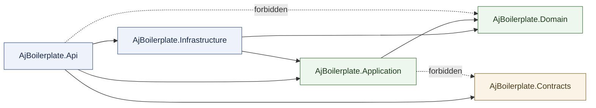
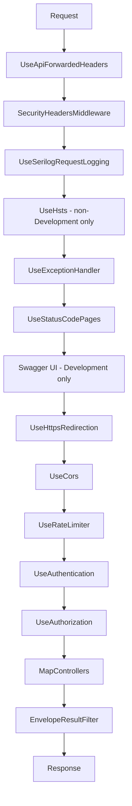
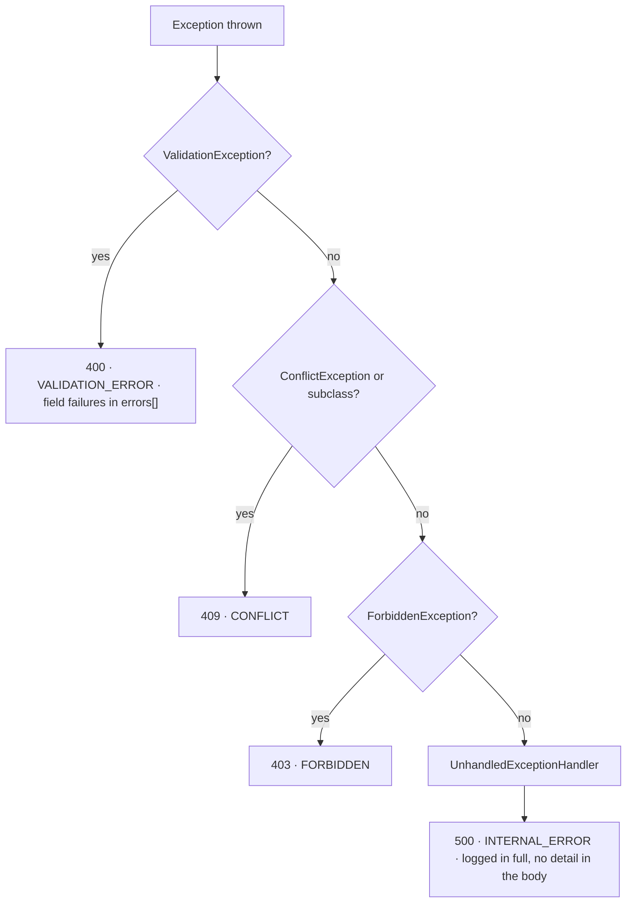
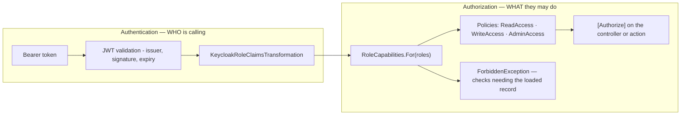
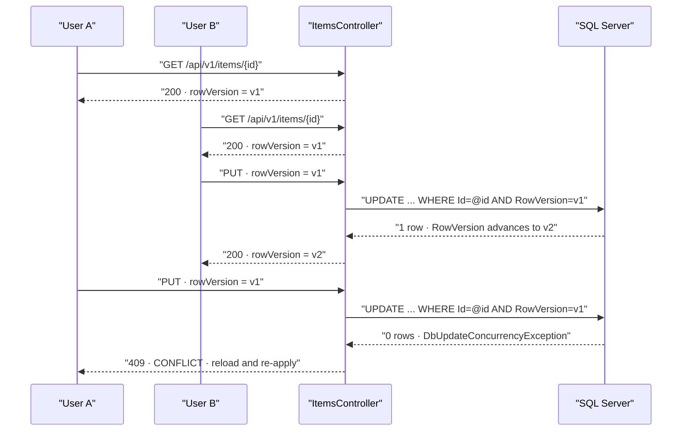
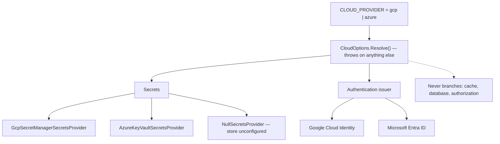
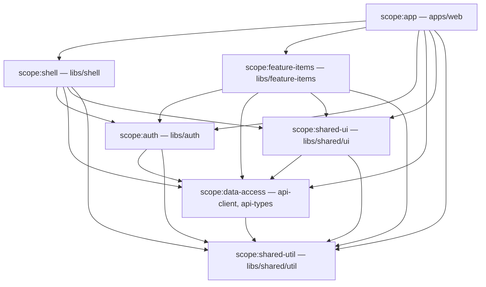
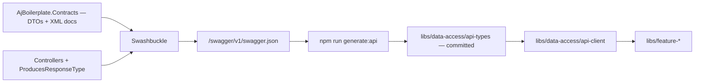

# Architecture

A layer-by-layer tour of the repository, written for someone who cloned it ten minutes ago.

Every layer below is described the same way: **what it is for**, **what may live there**, **what
may not**, **what it depends on**, **a concrete example with real file paths**, and **the mistake
newcomers actually make** with it.

Two modules ship, and the examples draw on both. `Item` is the sample slice — it proves the path
end to end and is meant to be deleted on day one. `Features`, the ["What's new" feature
spotlight](whats-new.md), is domain-free plumbing that is meant to stay; it appears at every layer
alongside `Items/`, so the two together show what a second module looks like rather than leaving
you to guess.

The short version: dependencies point inward, the wire contract is a separate thing from the
domain model, and both rules are enforced by tests rather than by good intentions.

**Contents**

- [The backend](#the-backend)
  - [The dependency rule, and the tests that enforce it](#the-dependency-rule-and-the-tests-that-enforce-it)
  - [`AjBoilerplate.Domain`](#ajboilerplatedomain)
  - [`AjBoilerplate.Application`](#ajboilerplateapplication)
  - [`AjBoilerplate.Contracts`](#ajboilerplatecontracts)
  - [`AjBoilerplate.Infrastructure`](#ajboilerplateinfrastructure)
  - [`AjBoilerplate.Api`](#ajboilerplateapi)
  - [The three test projects](#the-three-test-projects)
- [Why these boundaries exist](#why-these-boundaries-exist)
- [Cross-cutting machinery](#cross-cutting-machinery)
  - [The request pipeline](#the-request-pipeline)
  - [How an exception becomes a status code](#how-an-exception-becomes-a-status-code)
  - [The response envelope](#the-response-envelope)
  - [Correlation ids](#correlation-ids)
  - [Where authentication ends and authorization begins](#where-authentication-ends-and-authorization-begins)
  - [Optimistic concurrency](#optimistic-concurrency)
  - [Outbox and inbox](#outbox-and-inbox)
  - [The `CLOUD_PROVIDER` switch and `ISecretsProvider`](#the-cloud_provider-switch-and-isecretsprovider)
- [The frontend](#the-frontend)
  - [The library boundary rule](#the-library-boundary-rule)
  - [`apps/web`](#appsweb)
  - [`apps/web-e2e`](#appsweb-e2e)
  - [`libs/data-access/api-types`](#libsdata-accessapi-types)
  - [`libs/data-access/api-client`](#libsdata-accessapi-client)
  - [`libs/auth`](#libsauth)
  - [`libs/shared/util`](#libssharedutil)
  - [`libs/shared/ui`](#libssharedui)
  - [`libs/shell`](#libsshell)
  - [`libs/feature-items`](#libsfeature-items)
- [The seam between the two stacks](#the-seam-between-the-two-stacks)
- [Deleting the sample slice](#deleting-the-sample-slice)

---

## The backend

Five source projects and three test projects, all listed in
`src/backend/AjBoilerplate.slnx`:

```
src/backend/
├── src/
│   ├── AjBoilerplate.Domain/          entities and invariants — references nothing internal
│   ├── AjBoilerplate.Application/     use cases, ports, validation
│   ├── AjBoilerplate.Contracts/       wire DTOs and the response envelope
│   ├── AjBoilerplate.Infrastructure/  EF Core, cache, transports, cloud secrets
│   └── AjBoilerplate.Api/             controllers, middleware, auth, composition root
└── tests/
    ├── AjBoilerplate.UnitTests/
    ├── AjBoilerplate.IntegrationTests/
    └── AjBoilerplate.ArchitectureTests/
```

### The dependency rule, and the tests that enforce it

Here is the whole rule as one picture. An arrow means "may reference"; anything not drawn is
forbidden.



Those two dotted arrows are the interesting part, and both are asserted directly. The rules are
not a convention in a document — they are xUnit facts in
`src/backend/tests/AjBoilerplate.ArchitectureTests/DependencyRuleTests.cs`, which inspects each
assembly's **compiled references** via `Assembly.GetReferencedAssemblies()`:

| Test | What it asserts |
|---|---|
| `Domain_depends_on_nothing_internal` | `Domain` references none of `Application`, `Infrastructure`, `Api`, `Contracts` |
| `Application_does_not_depend_on_infrastructure_or_api` | `Application` references neither `Infrastructure` nor `Api` |
| `Application_does_not_depend_on_the_wire_contracts` | `Application` does **not** reference `Contracts` |
| `Infrastructure_does_not_depend_on_api` | `Infrastructure` does not reference `Api` |
| `Contracts_contains_no_dependency_on_other_layers` | `Contracts` references no other layer at all |
| `Api_does_not_reference_domain_directly` | `Api` does **not** reference `Domain` |

The file's own comment explains why it checks compiled references rather than `using`
statements: *"a using-statement grep can be satisfied by a fully qualified name, but an assembly
reference cannot be hidden. If one of these fails, the fix is almost never to relax the test — it
is to move the type that leaked across the boundary."*

A second file, `src/backend/tests/AjBoilerplate.ArchitectureTests/ControllerConventionTests.cs`,
enforces three controller conventions by reflection over every non-abstract `ControllerBase`:

| Test | What it asserts |
|---|---|
| `There_is_at_least_one_controller_to_check` | the reflection filter matched something, so the two below cannot pass vacuously |
| `Every_controller_is_authorized_or_explicitly_anonymous` | every controller carries `[Authorize]` **or** an explicit `[AllowAnonymous]` — an endpoint's authentication posture is never implicit |
| `Every_controller_route_is_versioned` | every controller's `[Route]` template starts with `api/v` |

Run them on their own:

```bash
dotnet test src/backend/tests/AjBoilerplate.ArchitectureTests
```

They need no database and no container, so they are the cheapest gate in the repository.

---

### `AjBoilerplate.Domain`

**Single responsibility.** Hold the business objects and the rules that must be true of them
regardless of how they are stored, transported, or displayed.

**May live here**

- Aggregate roots and entities with private setters and validating factory methods
- Enums describing a lifecycle
- `DomainException`, for an invariant violation
- Small pure helpers over domain values (`Common/PrivacyHash.cs` hashes an IP or user agent that
  an audit row may correlate on but must never store raw)
- Base types shared by every persisted root — `Common/AuditedEntity.cs` carries `CreatedAt`,
  `UpdatedAt`, and the `RowVersion` concurrency token

**May not live here**

- EF Core, ASP.NET Core, Serilog, a cloud SDK, or any other framework — check
  `src/backend/src/AjBoilerplate.Domain/AjBoilerplate.Domain.csproj` and note that it has **zero**
  `PackageReference` and **zero** `ProjectReference` entries
- Persistence concerns: no attributes, no navigation-property tricks that only exist for the ORM
- Role vocabulary. `Common/Actor.cs` records *who acted* and treats `Role` as an opaque tag; the
  Domain never enumerates roles

**Depends on.** Nothing. It is the innermost layer.

**In the sample slice.** `src/backend/src/AjBoilerplate.Domain/Items/Item.cs` is a deliberately
complete example of the house style, not a stub:

- a private constructor plus a `Create` factory that normalises and bounds its inputs
- all mutation through behaviour methods (`Update`, `Archive`, `Restore`) rather than public setters
- invariants raised as `DomainException` **inside the entity** — an archived item cannot be
  edited, and the check lives in `Item.Update`, not in the controller
- `Archive` is idempotent on purpose, so a retried request cannot fail for having already succeeded
- length limits as constants (`Item.MaxNameLength`, `Item.MaxDescriptionLength`) that the EF
  configuration and the request validators both read, so all three cannot drift

**In the `Features` module.** `Features/FeatureAnnouncement.cs` is an aggregate with no write API
at all: announcements arrive as data, so it exposes `Create` plus `Retire`/`Reinstate` and nothing
else. `Features/FeatureAcknowledgement.cs` is one user's dismissal of one announcement — the row's
existence *is* the mechanism.

`Features/FeaturePath.cs` is the piece worth reading twice. Page targeting is a prefix comparison,
and a prefix comparison against an unresolved path is exploitable: `/reports/../admin` literally
starts with `/reports`, so an announcement scoped to the reports area would fire on what actually
resolves to `/admin`. `Normalize` therefore drops the query string and fragment and resolves `.`
and `..` on a stack (which can never walk above the root) *before* any comparison, and
`FeatureAnnouncement.Targets` calls it itself rather than trusting a caller to have done so. It is
a security control that happens to look like string formatting — do not "simplify" it. A second
deliberate behaviour lives next to it: an empty page list matches every route, and a `PagesJson`
value the parser cannot read degrades to the same rather than throwing, because this runs on a
read-only lookup fired on every navigation and one bad row must not 500 every page for every user.

**The common mistake.** Reaching for a framework "just for this one thing" — a `[Required]`
attribute, an `IQueryable`, a `DateTime.UtcNow`. The moment the Domain has a package reference, it
stops being independently testable and every rule in it becomes hostage to a framework upgrade.
The second most common mistake is a public setter: once `item.Status = ItemStatus.Archived` is
legal from the outside, the invariant in `Update` is decoration.

---

### `AjBoilerplate.Application`

**Single responsibility.** Express the use cases. This layer knows *what the system does*; it
does not know how anything is stored or transported.

**May live here**

- Use-case services and their interfaces — `Items/ItemService.cs` and `IItemService`,
  `Features/FeatureAnnouncementService.cs` and `IFeatureAnnouncementService`
- **Ports**: interfaces the outer layers implement. `Abstractions/` holds `IClock`,
  `ICurrentActor`, `ICorrelationContext`, `IEmailSender`, `ISecretsProvider`,
  `IOutboxRepository`, `IInboxRepository`, `IIntegrationEventPublisher`, `IEntityIdCodec`;
  `Items/IItemRepository.cs` is the persistence port for the sample slice
- Commands, queries, and the layer's own read models — `Items/ItemModels.cs`
- FluentValidation validators, declared **on the command**, not on the wire DTO
- Application-level exceptions that describe an outcome rather than a transport:
  `Common/ApplicationExceptions.cs` defines the abstract `ConflictException` and `ForbiddenException`
- Shared paging bounds — `Common/Paging.cs`

**May not live here**

- A `DbContext`, a connection string, an HTTP client, a cloud SDK call
- `DateTime.UtcNow`. Take `IClock` instead
- Any `AjBoilerplate.Contracts` type. The architecture test
  `Application_does_not_depend_on_the_wire_contracts` fails the build if one appears

**Depends on.** `AjBoilerplate.Domain` only, plus a small, justified package set. Two of those
packages deserve a note, because they look like leaks and are not:

- `Microsoft.EntityFrameworkCore` — for `DbUpdateConcurrencyException`, the type
  `ItemService.UpdateAsync` catches to turn a lost race into a `StaleItemException`
- `Microsoft.Data.SqlClient` — read only for the SQL Server error numbers in
  `Persistence/SqlDeadlockVictim.cs` (error 1205) and `Persistence/SqlUniqueConstraintViolation.cs`,
  so a lost race becomes a clean idempotent or 409 result instead of a raw 500. The `.csproj`
  carries the reasoning inline

**In the sample slice.** `src/backend/src/AjBoilerplate.Application/Items/ItemService.cs` shows the
whole shape: validate the command, load through the port, drive the domain method, save, map to
the layer's own `ItemDto`. Note what it does **not** do — it never constructs an HTTP response and
never mentions a status code. `GetAsync` returns `null` for a missing item, because "not found" is
a foreseeable outcome, not an exception; `UpdateAsync` throws `StaleItemException` (a
`ConflictException`) for a lost concurrency race, because that genuinely is exceptional.

`Items/ItemModels.cs` also holds `ItemStatusNames`, the one place that translates between the
`ItemStatus` enum and its wire name in both directions. Its own comment names the bug it prevents:
a validator that accepts a value the parser then silently maps to the enum's default.

`Items/ItemValidators.cs` puts the rules on the command rather than on the DTO, so **every** caller
of the use case is validated — including one that never arrived over HTTP. It also draws a line
worth copying: a missing or malformed `RowVersion` is a 400 (a client bug), never a 409, because a
409 would tell the user someone else had edited the record when nobody had.

**In the `Features` module.** `Features/FeatureAnnouncementService.cs` has two use cases and three
decisions in it worth copying.

*Idempotency is computed here, not caught from the database.* `AcknowledgeAsync` reads which of the
requested ids this user already acknowledged and inserts only the remainder, so a double-click or a
retried request writes nothing and succeeds — instead of raising a unique-constraint violation that
would have to be caught, classified by SQL error number, and translated back into the success it
always was. The unique index on `(UserId, FeatureId)` stays as the backstop for the one case an
application check cannot cover: two requests racing past it at the same instant.

*An id naming no announcement is dropped rather than inserted*, because the foreign key would
otherwise reject the whole batch — including in a legitimate race, where an announcement was
deleted between the lookup that handed the client these ids and the dismissal that sends them back.

*Page matching runs in memory, on purpose.* `GetUnacknowledgedAsync` asks the port for the active
set (already ordered by the index that exists for it), then filters with `Targets`. Resolving a
caller's path and comparing it against a JSON array of prefixes is work SQL Server would do badly
and could not index anyway. `RequireAuthenticatedUser` refuses `anonymous`/`system` actor ids even
though the endpoint policy already rejects them — acknowledgement is recorded per user, and
attributing rows to a shared pseudo-identity would mark an announcement dismissed for everyone.

`Features/FeatureValidators.cs` bounds the path at 2048 characters and the id batch at 200, and
treats an **empty** id list as valid: dismissing nothing is a successful no-op, not a client error.

**The common mistake.** Putting the business rule in the service instead of the entity. If
`ItemService` had checked `if (item.Status == ItemStatus.Archived) throw`, the rule would apply only
to that one code path. It lives in `Item.Update` so it applies to every caller forever. The second
most common mistake is injecting `AppDbContext` "temporarily" — the moment that happens, the layer
can no longer be unit-tested without a database, and the port was pointless.

---

### `AjBoilerplate.Contracts`

**Single responsibility.** Describe the wire. These are the only shapes that cross the API
boundary, and the OpenAPI document is generated from them.

**May live here**

- Request and response records — `Items/ItemContracts.cs` holds `ItemResponse`,
  `CreateItemRequest`, `UpdateItemRequest`; `Features/FeatureContracts.cs` holds
  `FeatureAnnouncementResponse` and `AcknowledgeFeaturesRequest`
- The envelope — `Common/ApiResponse.cs` (generic and non-generic) and `Common/PagedResponse.cs`
- `Common/EnvelopeCodes.cs`: the stable `code` slugs a client branches on
- XML documentation comments, which become the descriptions in the generated OpenAPI document.
  `AjBoilerplate.Contracts.csproj` sets `GenerateDocumentationFile` for exactly that reason, and
  `Program.cs` feeds `AjBoilerplate.Contracts.xml` into `IncludeXmlComments`

**May not live here**

- Logic of any kind. These are records and constants
- Any reference to another layer. `Contracts_contains_no_dependency_on_other_layers` asserts it
- A domain enum. `ItemResponse.Status` is a `string`, not `ItemStatus` — see below

**Depends on.** Nothing.

**In the sample slice.** `src/backend/src/AjBoilerplate.Contracts/Items/ItemContracts.cs`.
`ItemResponse.RowVersion` is a base64 `string`, while the Application layer's `ItemDto.RowVersion`
is a `byte[]`; the controller converts between them. That is the pattern in miniature — the wire
shape is chosen for clients, the internal shape for correctness, and one place maps between them.

**In the `Features` module.** `Features/FeatureContracts.cs` publishes `FeatureAnnouncementResponse`
— which deliberately omits `PagesJson` and `IsActive`. Page targeting and activation are decisions
the server makes; a client that could see them would eventually re-implement the matching, and the
prefix list is not information a browser needs. `AcknowledgeFeaturesRequest.FeatureIds` is nullable
on the wire, and `FeaturesController` coalesces it to an empty list — so a body that omits the
property acknowledges nothing and answers 204, which is what "dismiss these zero announcements"
should do.

**The common mistake.** Returning the EF entity because it "has the same fields". It does not:
it has navigation properties that serialise into loops or over-fetch, private setters that model
binding will happily bypass on the way in, and internal fields nobody meant to publish. Worse, it
welds the wire contract to the schema — the next migration becomes a breaking API change by
accident.

---

### `AjBoilerplate.Infrastructure`

**Single responsibility.** Implement the ports the Application layer declared, using real
technology.

**May live here**

- `Persistence/AppDbContext.cs`, the entity configurations under `Persistence/Configurations/`,
  the repositories, and the migrations under `Persistence/Migrations/`
- `Time/SystemClock.cs` — the only place in the codebase that reads the machine's wall clock
- `Secrets/` — `GcpSecretManagerSecretsProvider`, `AzureKeyVaultSecretsProvider`,
  `NullSecretsProvider`
- Transports: `Email/SmtpEmailSender.cs` and its logging no-op counterpart,
  `Messaging/LoggingIntegrationEventPublisher.cs`
- `Security/AesEntityIdCodec.cs`, `Health/DbContextHealthCheck.cs`
- `DependencyInjection.cs`, the layer's composition root

**May not live here**

- A business rule. If a repository decides something, that decision has escaped the domain
- Anything from `AjBoilerplate.Api`. `Infrastructure_does_not_depend_on_api` asserts it
- A cloud branch outside the one place that owns it — see
  [the `CLOUD_PROVIDER` switch](#the-cloud_provider-switch-and-isecretsprovider)

**Depends on.** `Application` and `Domain`.

**In the sample slice.** `Persistence/ItemRepository.cs` is the reference implementation of a
repository: `AsNoTracking()` on the read-only list projection, `EF.Functions.Like` so the search
runs as real SQL rather than a client-side `Contains` that would pull the table into memory, LIKE
metacharacters escaped so a user typing `%` does not get a wildcard, `Count` and `Skip`/`Take` both
executed in the database, and an ordering of `(CreatedAt desc, Id)` rather than `CreatedAt` alone —
because an unstable sort makes paging skip and repeat rows.

`Persistence/Configurations/ItemConfiguration.cs` maps the table and stores `Status` **as its
name** (`HasConversion<string>()`), so reordering the enum can never silently reinterpret existing
rows.

`Persistence/AppDbContext.cs` carries one subtle global convention worth reading before you add a
`DateTime` column: SQL Server `datetime2` is Kind-less, so a reloaded value comes back
`Unspecified` and `System.Text.Json` then serialises it without the trailing `Z`. The context
re-labels Kind on the way in and out. New timestamps should prefer `DateTimeOffset`, which
round-trips unambiguously — the sample `Item` does.

**In the `Features` module.** `Persistence/FeatureAnnouncementRepository.cs` and the two
configurations under `Persistence/Configurations/` map the **second set of tables** in the schema,
`feat_Features` and `feat_Acknowledgements`, created by
`Persistence/Migrations/20260803100548_AddFeatureAnnouncements.cs`.

That migration creates the two tables and their four indexes and **nothing else — there is no seed
row**, and an empty announcements table is the correct state for a fresh clone. Each announcement
ships afterwards as its own INSERT-only migration; no service, controller, or frontend change is
ever needed to add one. (The demo build shows a sample announcement, but that comes from the MSW
handler in `apps/web/src/mocks/handlers.ts` — a browser mock, not seed data.)

Three mapping decisions carry the module's correctness:

- `IX_feat_Acknowledgements_User_Feature` is **unique** on `(UserId, FeatureId)`. It is a
  correctness constraint rather than tuning — it is what makes a dismissal permanent and
  un-duplicable when two requests race past the service's own idempotency check, and it is the
  index the "has this user seen it?" lookup seeks on.
- `UserId` is `nvarchar(128)` with **no foreign key**. `Actor.Id` is an external IdP subject claim,
  not a local key and not a GUID; users do not live in this schema, so there is nothing to
  reference.
- `IX_feat_Features_Active_Order` covers the hot path exactly — filter on `IsActive`, order by
  `DisplayOrder` — because that lookup runs on every navigation of every signed-in client. The
  repository adds `Id` as a final tiebreak so two announcements created in the same tick with the
  same order still come back in a stable sequence.

Deleting an announcement cascades to its acknowledgements: they mean nothing without it, and
leaving them would either block the delete or strand orphan rows.

**The common mistake.** Letting a query decide policy. "The repository filters out archived items"
sounds harmless until a second caller needs them and the rule is invisible from the use case. Ports
return data; use cases decide. The other recurring mistake is `EnsureCreated()` — the schema here
is owned exclusively by migrations, and `EnsureCreated` produces a database that no migration has
ever been applied to, which then diverges from every deployed environment.

---

### `AjBoilerplate.Api`

**Single responsibility.** Compose everything, map HTTP to use cases and back, and own the
cross-cutting middleware.

**May live here**

- Thin controllers — `Controllers/ItemsController.cs`, `Controllers/FeaturesController.cs`
- The composition root, `Program.cs`
- Cross-cutting middleware and filters under `Infrastructure/`: the exception handlers, the
  envelope result filter, the status-code pages, security headers, rate limiting, CORS,
  forwarded headers
- Authentication and policy wiring under `Identity/`
- Configuration sources under `Configuration/`, observability under `Observability/`, and the
  hosted service that drives the outbox under `Messaging/`

**May not live here**

- Business rules. A controller that contains an `if` about the domain has taken a rule from
  somewhere it belonged
- A hand-built error response. `EnvelopeResultFilter` and the handler chain own that
- Any `AjBoilerplate.Domain` type. `Api_does_not_reference_domain_directly` asserts it

**Depends on.** `Application`, `Infrastructure`, `Contracts` — and deliberately **not** `Domain`.

**In the sample slice.** `src/backend/src/AjBoilerplate.Api/Controllers/ItemsController.cs` is one
of the two controllers that ship. Everything about it is intentional:

- `[Route("api/v1/items")]` — versioned from day one, as `Every_controller_route_is_versioned` requires
- `[Authorize(Policy = Policies.ReadAccess)]` on the class, `[Authorize(Policy = Policies.WriteAccess)]`
  on each mutation, so a viewer can list and fetch but change nothing
- No action builds an envelope. They return `Ok(...)`, `NotFound()`, `CreatedAtAction(...)`,
  `NoContent()`, and `EnvelopeResultFilter` wraps the result globally
- `ParseRowVersion` decodes the base64 token and returns an empty array for garbage, so the command
  validator turns malformed input into a clean 400 rather than an unhandled 500
- `ProducesResponseType` for the failures as well as the success, because the OpenAPI document is
  only as good as its annotations and a client generated from a happy-path-only document has no
  idea how the endpoint fails

**In the `Features` module.** `Controllers/FeaturesController.cs` exposes exactly two endpoints:

| Endpoint | Answers | Policy |
|---|---|---|
| `GET /api/v1/features/unack?path=/reports/monthly` | `200` with the announcements this user has not dismissed whose page list matches — an empty array is the normal answer | `Policies.ReadAccess` |
| `POST /api/v1/features/ack` | `204` with no body; idempotent | `Policies.ReadAccess` |

Both sit on `ReadAccess` — the widest policy, satisfied by every recognised role — and that is the
deliberate part. Dismissing writes a row about the **caller**, not about a business record, so it
is not a write privilege: a read-only user must still be able to close the popup. Putting `ack`
behind `WriteAccess` would leave viewers staring at a modal they cannot clear.

The controller does nothing else. It hands the query straight to the service, maps
`FeatureAnnouncementDto` to `FeatureAnnouncementResponse`, and lets `EnvelopeResultFilter` wrap
both. Path canonicalisation is **not** done here — it happens in the Domain, where it cannot be
bypassed by a second caller (see [`AjBoilerplate.Domain`](#ajboilerplatedomain)).

**The common mistake.** Doing work in the controller. The tell is a `try`/`catch` — if an action
catches an exception to shape a response, it is duplicating the handler chain and will drift from
it. The other classic is adding a `using AjBoilerplate.Domain...` to "just map the enum", which
breaks the build at the architecture test rather than at review, which is exactly the intent.

---

### The three test projects

| Project | Tests | What it proves | Needs |
|---|---|---|---|
| `AjBoilerplate.UnitTests` | 185 | Domain invariants, use-case branches, validators, mappers, the claims and role tables, the log sanitizer, the id codec | nothing |
| `AjBoilerplate.IntegrationTests` | 51 | The real request path end to end against a real SQL Server | Docker |
| `AjBoilerplate.ArchitectureTests` | 9 | The dependency rule and the controller conventions | nothing |

245 backend tests in total, alongside 178 on the frontend (`npx nx run-many -t test --all`). Treat
those figures as a snapshot, not a target — `dotnet test src/backend/AjBoilerplate.slnx` prints the
current ones.

The integration suite is worth understanding before you write your first test.
`Support/SqlServerFixture.cs` starts **one** throwaway SQL Server container
(`mcr.microsoft.com/mssql/server:2022-latest`) via Testcontainers for the whole suite, applies the
EF Core migrations to it, and shares it across every class in `DatabaseCollection`. There is no
in-memory provider anywhere in this repository, on purpose: a suite that cannot see a unique index,
a real `rowversion`, or the SQL that EF Core actually emits is not testing the integration.
Testcontainers generates the container password at run time, so no credential is committed.

`Support/ApiFactory.cs` boots the real application — the real middleware order, the real handler
chain, the real envelope filter, the real policies — and swaps exactly two things: the
authentication scheme (for `Support/TestAuthHandler.cs`, so a test can act as a role without a live
identity provider) and the connection string. It supplies the connection string as an **environment
variable** rather than through `ConfigureAppConfiguration`, and the file explains why: `Program.cs`
reads `ConnectionStrings:Default` during service registration, before `builder.Build()`, which is
when a test host's configuration callbacks are applied.

```bash
dotnet test src/backend/tests/AjBoilerplate.UnitTests          # fast, no dependencies
dotnet test src/backend/tests/AjBoilerplate.ArchitectureTests  # fast, no dependencies
dotnet test src/backend/tests/AjBoilerplate.IntegrationTests   # needs Docker running
```

---

## Why these boundaries exist

Boundaries that nobody can explain get deleted the first time they are inconvenient. Here is the
reasoning for the four that surprise people most.

### Why `Api` must not reference `Domain`

This is the rule that shapes the most code, so it is worth being precise. If the Api project could
see `AjBoilerplate.Domain`, the path of least resistance would be to bind an entity to a request
body or serialise one into a response — and the wire contract would then be whatever the schema
happens to be this week. Removing the reference makes that physically impossible rather than merely
discouraged.

Read what it costs, because the cost is visible in the code:

- `ItemDto.Status` (Application layer) is a `string`, not the `ItemStatus` enum, so the enum type
  stops at that boundary
- `ItemStatusNames` in `src/backend/src/AjBoilerplate.Application/Items/ItemModels.cs` owns the
  string-to-enum translation in both directions
- `IActorClaims` in `src/backend/src/AjBoilerplate.Application/Identity/IActorClaims.cs` exposes the
  authenticated caller as **primitive strings only**. The Api implements it over `HttpContext.User`
  (`Identity/HttpContextActorClaims.cs`), and `ClaimsCurrentActor` — in the Application layer — is
  the only place that turns those primitives into a domain `Actor`

That last one is the clearest illustration: the Api layer never constructs a domain type, so it
never needs the reference, so the test can assert the reference is absent. The boundary is not
paperwork; it is why those two files exist in the shape they do.

### Why DTOs never expose EF entities

An entity is a *model of a rule*. A DTO is a *promise to a client*. They change for entirely
different reasons — an index, a column split, or a navigation property is a schema decision, while
adding a field or widening a type is a contract decision that has to be versioned. Fusing them means
every schema change is a potential breaking API change, and the breakage is discovered by the
client, in production.

There is a security dimension too. Model binding onto an entity is how mass assignment happens: a
request that includes `"rowVersion": "..."` or `"createdAt": "..."` gets to set fields the client
was never meant to control. `CreateItemRequest` simply has no such properties.

### Why `IClock` exists instead of `DateTime.UtcNow`

`src/backend/src/AjBoilerplate.Application/Abstractions/IClock.cs` is a two-property interface, and
`src/backend/src/AjBoilerplate.Infrastructure/Time/SystemClock.cs` is its only real implementation
— "the only place in the codebase that reads the machine's wall clock."

The reason is testability, and it is not theoretical. `FixedClock` in
`src/backend/tests/AjBoilerplate.UnitTests/Support/Fakes.cs` freezes time at a chosen instant and
can `Advance` it, which is what lets `ItemServiceTests` assert that `CreatedAt` is exactly the
expected value and that an update produces a *different* `UpdatedAt`. With `DateTime.UtcNow` those
assertions can only be approximate, and an approximate assertion about time is a flaky test waiting
for a slow CI runner.

`IClock` also exposes both `UtcNow` (a `DateTime`) and `UtcNowOffset` (a `DateTimeOffset`) so
callers never have to convert at the call site and accidentally introduce a local-time bug.

### Why the envelope is uniform

Every response — success, failure, and the ones the framework produces before any controller runs —
has the same shape:

```json
{ "success": true, "data": {}, "message": null, "errors": null,
  "statusCode": 200, "code": null, "timestamp": "...", "traceId": "..." }
```

A client that can rely on that shape needs exactly one place to unwrap it and exactly one place to
turn a failure into an error. In this repository those places are
`src/frontend/libs/data-access/api-client/src/lib/envelope-interceptor.ts` and `ApiError` beside
it — and because they exist, no feature component in the Angular app ever writes `response.data` or
inspects a status code.

Uniformity only pays if it is total, which is why there are two producers rather than one.
`Infrastructure/EnvelopeResultFilter.cs` wraps whatever a controller returns;
`Infrastructure/EnvelopeStatusCodePages.cs` wraps the replies that never reach a controller at all
— an `[Authorize]` challenge, an unmatched route, a wrong verb, a wrong content type, a rate-limit
rejection. Both read their message and `code` from the same table,
`Infrastructure/EnvelopeErrors.cs`, and that file records the bug that made it necessary: a 404
from an unmatched route used to report `NOT_FOUND` while a controller's `NotFound()` reported
`REQUEST_FAILED`, so a client branching on `code` broke depending on which path it hit.

---

## Cross-cutting machinery

### The request pipeline

Middleware order in `src/backend/src/AjBoilerplate.Api/Program.cs` is load-bearing, and the file
says so in capitals. The order that ships, with the reason each position was chosen:



- **Forwarded headers first** so `X-Forwarded-For` is resolved into `Connection.RemoteIpAddress`
  before anything reads the client IP. Without it, the rate limiter would partition every anonymous
  caller behind a proxy into one shared bucket. It is opt-in via `ForwardedHeaders:Enabled`, so a
  proxy-less deployment is never weakened.
- **Security headers second** so they stamp *every* response, including the error and 404 replies
  produced further down — which is exactly where they are most often missing.
- **Request logging** uses `{SanitizedPath}` rather than Serilog's default `{RequestPath}`. Any
  credential that travels in a URL — a reset token, a signed link's signature, an OAuth code —
  would otherwise be written verbatim into the log on every request. See
  `Observability/RequestLogSanitizer.cs`.
- **Exception handling before anything that can throw**, with status-code pages immediately after,
  so a bodiless framework reply still ships an envelope.
- **Rate limiting before authentication**, deliberately: rejecting an over-quota request should not
  first cost a signature validation and a JWKS lookup, which is precisely the work an attacker
  wants to force.
- **Health endpoints** are mapped last and all three call `.DisableRateLimiting()`. `/health` is
  aliased to *liveness*, not readiness, so a transient database blip cannot flap a healthy instance
  out of the load balancer's rotation. `/health/ready` runs the checks tagged `ready`, which is
  currently just the database.

### How an exception becomes a status code

There are no `try`/`catch` blocks in the controller. Four `IExceptionHandler` implementations are
registered in `Program.cs`, in a fixed order, and each returns `false` for an exception it does not
own:



The order **is** the contract. `UnhandledExceptionHandler` claims everything, so moving it up would
swallow the three specific mappings and turn every 400, 409, and 403 into a 500. `Program.cs` says
this in a comment directly above the registrations.

Two design choices inside the chain are worth copying:

- `Infrastructure/ConflictExceptionHandler.cs` matches the **base** `ConflictException`, so a new
  conflict type is mapped correctly without this file changing. That is what stops a forgotten
  `switch` arm from silently turning a conflict into a 500. `StaleItemException` in
  `Items/ItemModels.cs` is the only subclass today.
- `Infrastructure/UnhandledExceptionHandler.cs` logs the full exception and returns *"An unexpected
  error occurred."* with a `traceId` and nothing else. A stack trace, a SQL fragment, or a type name
  in a response body is an information-disclosure defect; the `traceId` is how an operator connects
  the report to the log.

`AddProblemDetails()` is still registered, but only because `UseExceptionHandler()` throws at
startup without an `IProblemDetailsService`. A `problem+json` body is never actually produced,
because `UnhandledExceptionHandler` always handles first.

`Infrastructure/EnvelopeResultFilter.cs` handles the non-exception paths, and it has a subtlety
that will bite anyone who assumes otherwise: `[ApiController]`'s client-error filter rewrites a
bare `NotFound()` into a `ProblemDetails` `ObjectResult` **before** the result filter runs, so a
controller's 404 arrives as an object result, not a `StatusCodeResult`. The filter handles both and
routes them through `EnvelopeErrors` so they are indistinguishable to a client. `FileResult` and
`NoContentResult` pass through untouched — one is already-correct binary content, the other has no
body by definition.

| Situation | Status | `code` |
|---|---|---|
| FluentValidation failure, or model-binding validation | `400` | `VALIDATION_ERROR` |
| No credentials, or a token that does not validate | `401` | `UNAUTHORIZED` |
| Authenticated but the policy denies, or a `ForbiddenException` | `403` | `FORBIDDEN` |
| `NotFound()`, or an unmatched route | `404` | `NOT_FOUND` |
| Wrong HTTP verb | `405` | `METHOD_NOT_ALLOWED` |
| Any `ConflictException` — including a stale `RowVersion` | `409` | `CONFLICT` |
| Wrong content type | `415` | `UNSUPPORTED_MEDIA_TYPE` |
| Over the rate-limit quota | `429` | `TOO_MANY_REQUESTS` |
| Anything else | `500` | `INTERNAL_ERROR` |

The full table lives in `src/backend/src/AjBoilerplate.Api/Infrastructure/EnvelopeErrors.cs`, and
the slugs are declared in `src/backend/src/AjBoilerplate.Contracts/Common/EnvelopeCodes.cs`. Branch
on `code`; never on `message`.

### The response envelope

`src/backend/src/AjBoilerplate.Contracts/Common/ApiResponse.cs` defines both forms — `ApiResponse<T>`
for a payload and the non-generic `ApiResponse` for errors and bodiless successes. Collections use
`Common/PagedResponse.cs`, whose `Total` is the count across *all* pages so a client can render a
pager while `Items` holds only the current page.

The rule for controller authors is short: return the payload, never the envelope. If an action
constructs an `ApiResponse` itself, `EnvelopeResultFilter` recognises it and passes it through — but
doing so by hand is how one endpoint ends up with a subtly different shape.

### Correlation ids

One value ties a response, a log line, an audit entry, and an outbox row together:
`HttpContext.TraceIdentifier`.

- Every envelope carries it as `traceId` — set by `EnvelopeResultFilter`,
  `EnvelopeStatusCodePages`, and each exception handler
- `src/backend/src/AjBoilerplate.Api/Infrastructure/HttpCorrelationContext.cs` implements the
  Application-layer port `Abstractions/ICorrelationContext.cs` by reading the same value, so
  anything deeper in the stack can record it without knowing HTTP exists
- `OutboxMessage.CorrelationId` and `InboxMessage.CorrelationId` carry it onto the messaging path,
  so a consumer can join an event back to the request that raised it without deserialising the
  payload

That is why the frontend's `ApiError` keeps `traceId` and the UI is expected to show it in error
copy: it is the one value a user can read out to support, and support can find in the logs.

`Observability/TelemetrySetup.cs` adds OpenTelemetry traces and metrics; the OTLP exporter attaches
only when an endpoint is configured, so local runs are unaffected.

### Where authentication ends and authorization begins

The split is clean, and knowing exactly where the line falls saves a lot of confusion:



**Authentication** is `src/backend/src/AjBoilerplate.Api/Identity/AuthenticationSetup.cs`. It picks
a scheme in a strict order:

1. **Keycloak**, when the `Keycloak` configuration section is present. This is the recommended
   topology — Keycloak federates to the cloud identity provider and issues the tokens this API
   validates, so authorization is identical on every cloud. Signing keys come from
   `Keycloak:JwksUri` via `Identity/KeycloakSigningKeyProvider.cs`, falling back to OIDC discovery
   only when that is blank, and `Identity/KeycloakAuthenticationEvents.cs` rejects a token whose
   `azp` names a different client.
2. **The cloud identity provider directly** — Google Cloud Identity for `CLOUD_PROVIDER=gcp`,
   Microsoft Entra ID for `azure`. This is the **only** place authentication branches on the cloud,
   and the branch selects a configuration section and nothing more.
3. **Nothing configured** (local, offline, CI) — a bare JWT scheme with no signing authority, so
   protected endpoints correctly answer 401 rather than failing to start or, far worse, silently
   accepting anything.

Note `ClockSkew = TimeSpan.Zero` in both configured cases. The default five-minute tolerance lets
`JwtBearer` accept a token past its own `exp`; these are machine-to-machine tokens with no
interactive browser clock to accommodate.

**Authorization** starts once a `ClaimsPrincipal` exists. There are three policies —
`Policies.ReadAccess`, `Policies.WriteAccess`, `Policies.AdminAccess`
(`Identity/AuthorizationPolicies.cs`) — and none of them names a role inline. Each resolves through
`src/backend/src/AjBoilerplate.Application/Identity/RoleCapabilities.cs`, which is the single source
of truth for what a role may do and fails closed for anything unrecognised.

`src/backend/src/AjBoilerplate.Application/Identity/ApplicationRoles.cs` holds the role vocabulary
and the one canonicalisation table. Its comment explains a real trap: Keycloak emits lowercase role
*keys* (`admin`) while everything user-facing uses a display *name* (`Admin`), and **both spellings
genuinely arrive in a single token** — the JWT handler projects the raw key into a role claim and
the claims transformation appends the display name. Keeping one table is what stops the Api-layer
transformation and the Application-layer policies from drifting apart, and that drift is invisible
on the server until someone's list silently comes back empty.

Two checks that policies cannot make belong in the service layer instead: ownership and record
scope, which are only decidable after the record is loaded. Those throw `ForbiddenException`, which
`ForbiddenExceptionHandler` maps to the same enveloped 403 a policy failure produces.

### Optimistic concurrency

This is the one behaviour the sample slice exists to demonstrate end to end, because it is the
thing most starter templates skip and most products need.



`RowVersion` on `src/backend/src/AjBoilerplate.Domain/Common/AuditedEntity.cs` is a SQL Server
`rowversion`: the **database** issues and advances it on every insert and update, and EF Core puts
the loaded value into the `WHERE` clause of every `UPDATE` and `DELETE`. That placement is the whole
point — a lost update is rejected by the engine, inside the same statement, with no window between
the check and the write. A token the application assigns cannot make that guarantee, because the
value it compares was read in an earlier statement.

`AuditedEntity.Touch` deliberately does **not** touch `RowVersion`; assigning it in memory would
overwrite the loaded original value EF Core needs for the concurrency predicate, silently disabling
the check.

`ItemService.UpdateAsync` has two guards and only the second is authoritative. The in-memory
comparison fails fast with a clear 409 before any work is done; the `catch (DbUpdateConcurrencyException)`
closes the window the first check leaves open. Both throw `StaleItemException`, so the caller sees
one outcome either way.

`src/backend/tests/AjBoilerplate.IntegrationTests/Persistence/ConcurrencyAndConstraintTests.cs`
proves the database really enforces it, against a containerised SQL Server — which is why the
in-memory provider is absent from this repository.

### Outbox and inbox

Two small tables give you reliable messaging without a distributed transaction.

**Outbox** — write the integration event in the *same* database transaction as the domain change
that raised it, then let a separate dispatcher deliver it.

- `src/backend/src/AjBoilerplate.Domain/Messaging/OutboxMessage.cs` — the row and its state machine
  (`Pending`, `Dispatched`, `Failed`). `MarkFailed` is safe to call repeatedly and keeps the
  historical `AttemptCount`; `ResetForRetry` refuses to run from any status but `Failed`
- `src/backend/src/AjBoilerplate.Application/Messaging/OutboxDispatcher.cs` — drains a batch of 50.
  A single message's publish failure is recorded **on that message's row** and the batch continues;
  one `SaveChangesAsync` covers the whole batch, and no exception escapes the loop to leave a
  half-applied unit of work
- `src/backend/src/AjBoilerplate.Api/Messaging/OutboxDispatcherHostedService.cs` — a
  `BackgroundService` on a 15-second `PeriodicTimer` that dispatches once immediately at startup.
  It creates a fresh `IServiceScope` per tick, because the dispatcher and its `DbContext` are scoped
  while a hosted service is a singleton, and it catches a tick's exception rather than letting it
  crash the service — an unhandled exception here would silently stop the outbox draining for the
  process's whole remaining lifetime
- `src/backend/src/AjBoilerplate.Infrastructure/Messaging/LoggingIntegrationEventPublisher.cs` — the
  no-op transport that ships. Replace it behind `IIntegrationEventPublisher` when you have a broker

**Inbox** — the mirror image, for events arriving from elsewhere.
`src/backend/src/AjBoilerplate.Domain/Messaging/Inbox/InboxMessage.cs` keys on `SourceEventId`, the
originating system's own event id; a consumer looks one up before doing any work, which makes
redelivery harmless. `IInboxRepository.ClearChangeTracking()` exists for one specific hazard, and
the port documents it: a SQL Server deadlock rolls back the transaction but does **not** clear EF
Core's change tracker, so a retry without clearing can insert a second duplicate-keyed row
alongside the still-tracked one that never committed.

Both tables ship in the `InitialCreate` migration and are configured in
`src/backend/src/AjBoilerplate.Infrastructure/Persistence/Configurations/`.

### The `CLOUD_PROVIDER` switch and `ISecretsProvider`

`CLOUD_PROVIDER` (bound to `Cloud:Provider`) accepts `gcp` or `azure`. What it actually changes is
narrower than most people expect — **two registrations**:



`src/backend/src/AjBoilerplate.Infrastructure/Cloud/CloudOptions.cs` owns the parsing, and
`Resolve()` **throws** on an unrecognised value. A typo must fail loudly at startup rather than
fall through to "whichever provider the enum happens to default to" and then read secrets from the
wrong cloud — or from no cloud at all. `Program.cs` logs the resolved provider once at
`Information` on boot, because which cloud's secret store a process is talking to is the most useful
line in a deployment's startup log and the most confusing thing to be silently wrong about.

The cache deliberately does **not** branch: Memorystore for Redis and Azure Cache for Redis speak
the same wire protocol, so one `ConnectionStrings:Redis` and one `AddStackExchangeRedisCache`
registration serve both, and the difference lives entirely in `infra/`. Neither does the database
(SQL Server on both), nor authorization (Keycloak on both).

Secrets have **two halves**, and conflating them is the usual confusion:

| | Boot-time | Runtime |
|---|---|---|
| Where | `src/backend/src/AjBoilerplate.Api/Configuration/CloudSecretsConfiguration.cs` | `src/backend/src/AjBoilerplate.Application/Abstractions/ISecretsProvider.cs` |
| What | Loads the whole secret set into `IConfiguration` before the host starts | Fetches one secret fresh, by logical name, without a restart |
| For | Connection strings, signing keys — anything the app cannot run without | A rotated third-party key, a per-tenant credential |
| Consumers see | Ordinary configuration; nobody knows a cloud is involved | An injected port; the only secrets surface an Application service may use |

`ISecretsProvider.GetSecretAsync` returns `null` for a secret the store does not hold, because a
missing secret is a foreseeable state (an optional integration nobody configured) rather than an
error. A genuine failure — an unreachable store, a denied permission — still throws.

When the selected provider's store is unconfigured, `NullSecretsProvider` is registered and the
boot-time source is a no-op, so configuration falls back to `appsettings`, user-secrets, and
environment variables. That is the local, test, and offline path, and it is why the repository runs
with no cloud account at all.

---

## The frontend

An Nx workspace at `src/frontend`: two applications and seven libraries.

```
src/frontend/
├── apps/
│   ├── web/          the Angular application and its routes, pages, and design tokens
│   └── web-e2e/      Playwright journeys and axe accessibility scans
└── libs/
    ├── auth/                    session, guards, role → capability map
    ├── data-access/api-types/   GENERATED from OpenAPI
    ├── data-access/api-client/  the only place that talks HTTP
    ├── shared/ui/               presentational components with no feature knowledge
    ├── shared/util/             framework-light helpers, no UI, no API
    ├── shell/                   the authenticated chrome
    └── feature-items/           THE SAMPLE FEATURE
```

Every component in the workspace is standalone, uses signals, and sets
`changeDetection: ChangeDetectionStrategy.OnPush`. PrimeNG is the only component library — no
native `<input>`, `<select>`, `<button>`, or `<table>` in feature code.

### The library boundary rule

Each project carries a `scope:*` tag in its `project.json`, and
`src/frontend/eslint.config.mjs` declares, per scope, which scopes it may import from via
`@nx/enforce-module-boundaries`. Violating it is a **lint error**, not a review comment.



Read off the shape: **nothing points upward, and feature libraries never point at each other.** If
two features need the same thing, it moves to `shared/*`. `shared/util` may depend only on
`shared/util`, which makes it the safe bottom of the graph.

When you add a feature library, its `scope:feature-*` tag goes in **two** places in
`eslint.config.mjs`: `scope:app`'s `onlyDependOnLibsWithTags` (so the app may route to it) and its
own entry listing the shared scopes it may consume. The file says this in its header comment.

---

### `apps/web`

**Single responsibility.** Be the composition root: routes, providers, public pages, and the design
tokens. It contains almost no logic.

**May live here.** `src/app/app.config.ts` (providers), `src/app/app.routes.ts` (routing),
`src/app/pages/` (the public pages that render *outside* the authenticated shell — login, auth
callback, signing out, access denied, not found, plus the authenticated landing page),
`src/design/tokens.css` and `src/design/components.css`, `src/styles/app-preset.ts` (the PrimeNG
theme preset), `src/mocks/` (the MSW handlers for the offline `demo` build).

**May not live here.** Feature logic — that belongs in a `libs/feature-*` library. Anything a second
app would need.

**Depends on.** Every library, per the `scope:app` constraint.

**In the sample slice.** `src/app/app.routes.ts` shows the routing shape to copy: public routes
first, then one guarded group with `canActivate: [authGuard]` rendering into `AppLayoutComponent`,
with the landing route **eager** (it is every user's first paint, so code-splitting it only adds a
round trip) and every feature route lazy via `loadComponent`. `items/new` and `items/:id` add
`capabilityGuard('canCreate')` and `capabilityGuard('canEdit')`.

`src/app/app.config.ts` is where the three DI seams are bound — `AUTH_TOKEN_PROVIDER`,
`TOKEN_REFRESHER`, `SESSION_EXPIRED_NOTIFIER` — which is how `data-access` handles auth without
importing `libs/auth` (the boundary rule forbids that direction). It also fixes the interceptor
order, with a comment: `authInterceptor` must run **before** `envelopeInterceptor` so that by the
time it inspects a failure it is looking at the unwrapped `ApiError`, not a raw
`HttpErrorResponse`.

**The common mistake.** Growing a page component in `apps/web/src/app/pages/` until it is a feature.
Once it fetches data or owns a workflow, it belongs in a library where the boundary rule applies to
it.

---

### `apps/web-e2e`

**Single responsibility.** Prove the critical journeys still work in a real browser, and that the
critical routes are accessible.

**May live here.** Playwright journeys (`src/journeys/`), axe scans (`src/accessibility/`), and
shared fixtures (`src/fixtures/`).

**May not live here.** Anything the application imports. It is a leaf.

**In the sample slice.** `src/journeys/items-crud.spec.ts` walks list → create → edit → delete using
role-based locators and `data-testid` hooks, never CSS selectors, and with no `waitForTimeout`.
`src/accessibility/critical-routes.spec.ts` runs axe with `wcag2a` and `wcag2aa` and **no rules
disabled**, waiting for the page to settle first via `src/fixtures/settle.ts` — scanning mid-fade
produces findings that do not survive the next frame.

`playwright.config.ts` runs the suite against the `demo` build configuration, which swaps in
`environment.demo.ts` so MSW starts before first render. That is what makes the suite
self-contained: no backend, no shared database, no test that fails because someone else's data
changed. Locale, timezone, and device scale factor are all pinned for determinism.

```bash
cd src/frontend && npx nx run web-e2e:e2e
```

**The common mistake.** Asserting on implementation details — a CSS class, a component internal —
instead of what a user can see. The second is adding `waitForTimeout` to fix a flake; the fixtures
exist so you do not have to.

---

### `libs/data-access/api-types`

**Single responsibility.** Be the API contract, expressed as TypeScript.

**May live here.** `src/lib/types.ts` and nothing else of substance. **It is generated output.**

**May not live here.** Anything hand-written. Anything with runtime behaviour beyond plain constants
for enum values.

**Depends on.** Nothing.

```bash
cd src/frontend && npm run generate:api
```

That runs `openapi-typescript` against the backend's OpenAPI document and **overwrites the whole
file**. The copy in the repository today is hand-written declarations, checked in only so the
workspace compiles before you have a backend running; the first `generate:api` replaces it. Point
the `generate:api` script in `src/frontend/package.json` at your backend's OpenAPI URL — the
document is served at `/swagger/v1/swagger.json` when the API runs in Development.

**In the sample slice.** `ApiResponse<T>`, `PagedResponse<T>`, `ItemStatus`, `ITEM_STATUSES`,
`ItemResponse`, `CreateItemRequest`, `UpdateItemRequest`, `ItemListRequest`.

**The common mistake.** Hand-editing it when the generated output is wrong. The output is a
symptom; the cause is a missing or inaccurate annotation on the server. Fix the annotation and
regenerate. The other mistake is re-declaring a server DTO somewhere else "just for this screen" —
a screen-specific view model is fine and expected, a hand-written duplicate of a server contract is
not.

---

### `libs/data-access/api-client`

**Single responsibility.** Be the only place in the workspace that talks HTTP.

**May live here.** HTTP interceptors, the error type, DI seams, and one typed service per feature
area.

**May not live here.** UI, routing decisions, business rules. An import of `@aj-boilerplate/auth` —
the boundary rule forbids it, which is precisely why the DI seams exist.

**Depends on.** `data-access` and `shared-util`.

**In the sample slice.**

| File | What it does |
|---|---|
| `src/lib/envelope-interceptor.ts` | Unwraps `ApiResponse<T>` so downstream code sees plain `T`; throws `ApiError` when `success: false`, **whatever the HTTP status**; passes `Blob` bodies through untouched |
| `src/lib/auth-interceptor.ts` | Attaches `Authorization: Bearer …`; on a 401 for a request that *carried* a token, attempts one refresh and retries exactly once, then fires the session-expired notifier |
| `src/lib/api-error.ts` | `ApiError` plus `isConflictError`, `conflictData`, and `apiErrorMessage` — one shared implementation so every `onError` reports a conflict identically |
| `src/lib/items-api.service.ts` | **SAMPLE** — the per-feature service pattern: one injectable, typed methods over `HttpClient`, versioned paths only, no manual envelope handling |
| `src/lib/feature-announcements-api.service.ts` | The "What's new" gateway: `unack(path)` and `ack(ids)`. `unack` coalesces a null envelope payload to `[]`, so no caller writes a null check for "nothing pending" |

`apiErrorMessage` always returns the same distinct copy for a 409 regardless of the caller's
fallback, because "reload and look again" is the only correct next step for a stale-record conflict.

One honest wart lives in this library and is flagged in the file itself:
`feature-announcements-api.service.ts` **declares** the `FeatureAnnouncement` interface locally,
because the announcements endpoints are not in the checked-in OpenAPI document yet. It is a
temporary exception to "never hand-write a server type", not a licence — once the document covers
them, regenerate `api-types`, delete the local interface, and import the generated one.

**The common mistake.** Writing `response.data` in a feature component. The interceptor already
unwrapped it; if you see `.data` outside this library, something is bypassing the interceptor. The
second is calling an unversioned path — `/api/items` instead of `/api/v1/items`.

---

### `libs/auth`

**Single responsibility.** Own the session, expose capabilities, and guard routes — as a **UX
convenience only**.

**May live here.** `src/lib/roles.ts` (the role list and the role → capability map — the only place a
role name may appear), `auth.service.ts`, `auth.guard.ts`, `capability.guard.ts`, the providers
under `src/lib/providers/`, and `sanitize-return-path.ts`.

**May not live here.** Anything that treats a client-side check as a security control. Any UI beyond
the guards' redirects.

**Depends on.** `data-access` and `shared-util`.

**In the sample slice.** `AuthService` holds the session as a signal and resolves the authoritative
profile through a TanStack query, falling back to the session's roles while that query is in flight
so the UI never flashes unauthorized-looking chrome. `authGuard` redirects to `/login` preserving a
**sanitized** return path — identity providers routinely echo their own protocol parameters onto the
post-logout landing URL, and capturing that verbatim puts the blob in the address bar and compounds
it across sign-in cycles.

`capabilityGuard('canEdit')` waits for `capabilitiesLoading()` to clear before it judges. Without
that wait, a cold page load (a bookmark, a refresh, a pasted link) would deny every capability-gated
route to every role, because the fallback capabilities are all-false until the profile resolves.

**The rule that matters**, quoted from `src/frontend/libs/auth/README.md`: *"Everything here is UX
only. Hiding a nav item or blocking a route does not protect anything — the backend authorizes every
request independently. Never implement a permission by hiding it in the client."* A user who types
the URL still gets a 403 from the server, which is the actual control.

**The common mistake.** A hard-coded role check in a component (`if (role === 'admin')`). Every gate
must derive from `capabilities()`, so there is exactly one place to change when the permission model
moves. The second mistake is believing the guard *is* the permission.

> **Note on `/api/v1/me`.** The OIDC provider fetches a `UserProfile` from `GET /api/v1/me`, and
> `libs/auth/README.md` lists implementing that endpoint as step 2 of wiring a real identity
> provider. The backend in this repository ships `ItemsController` and `FeaturesController` and
> nothing else, so that endpoint does not exist yet — you add it, then replace the hand-written
> `UserProfile` interface with the generated type.

---

### `libs/shared/util`

**Single responsibility.** Framework-light helpers with no UI and no API knowledge.

**May live here.** `format.ts` (dates, byte sizes, initials), `sort-by-label.ts` (the A–Z ordering
every dropdown uses by default), `validate-positive-int.ts`, `download.ts`,
`document-title.service.ts`, `language.service.ts`.

**May not live here.** Business calculations. A rule that belongs to a feature belongs in that
feature — or, if the server owns it, on the server. `format.ts` says so explicitly about currency:
rounding is a decision the product must make once, deliberately, and match against whatever the
server computes.

**Depends on.** Only itself — it is the bottom of the graph.

**In the sample slice.** `formatDateTime` and `sortByLabel` are used by both item pages.
`DISPLAY_TIME_ZONE` is `'UTC'` by default so two people in different places never read the same
instant differently.

**In the `Features` module.** `LanguageService` holds the current locale as a signal and offers one
`pick(en, ar)` helper. It exists because API payloads carry paired `*En`/`*Ar` fields — a
`FeatureAnnouncement` may ship English-only — and something has to choose which renders; `pick`
falls back through the other language before it gives up on an empty string, so a missing
translation is never a blank line. It is deliberately **not** an i18n framework, and the file says
so: if the product ever needs message catalogues, plural rules, or localised dates, adopt a real
library and delete this.

**The common mistake.** Using it as a junk drawer. A helper that only one feature calls belongs in
that feature; putting it here makes it everyone's dependency and nobody's responsibility.

---

### `libs/shared/ui`

**Single responsibility.** Presentational components with no feature knowledge.

**May live here.** `StatusPillComponent`, `ConfirmDialogComponent`, `EmptyStateComponent`,
`WhatsNewModalComponent`, and `QUERY_CLIENT` — the shared TanStack `QueryClient`, wired to toast
otherwise-unhandled API errors.

**May not live here.** `HttpClient`, routing decisions, or a feature import. A component belongs
here only once a **second** feature needs it — until then it lives in the feature that owns it.

**Depends on.** `data-access` and `shared-util`.

**In the sample slice.** `ConfirmDialogComponent` is the app's own yes/no modal, used in place of
`window.confirm()` for the item delete. `query-error-toasts.ts` holds the app-wide retry policy — a
4xx is a client error that retrying can never fix, so it fails into the error state immediately,
while 5xx and network failures get up to two retries — plus `GLOBAL_ERROR_TOAST_SUPPRESSED`, which
a query sets on its `meta` when it already renders its own error UI and does not want a redundant
toast on top.

**In the `Features` module.** `src/lib/whats-new-modal/` is the feature spotlight itself: a
carousel over the announcements the shell hands it, with a gradient hero band, a bouncing glyph,
and tinted benefit cards. It parses the body with a light markdown of its own —
`- 🔖 Title — description` becomes a card, any other non-empty line becomes a paragraph — and
`closed` emits **every** id it displayed, so one `POST` acknowledges the whole carousel.

Two behaviours in it look like bugs and are not. The backdrop is **inert**: `onBackdrop()` is an
empty method, because an acknowledgement is permanent and cross-device, so it may only be written
on an explicit "Got it" or close. And the modal owns no dismissal state of its own — the shell
clears it.

This component is also the codebase's one sanctioned break from the PrimeNG-only rule, with
bespoke markup and a bespoke stylesheet; only its icons come from PrimeIcons. The reasoning, and
the cost, are recorded in [ADR-0007](adr/0007-bespoke-whats-new-modal.md).

**The common mistake.** Redefining a colour in a component. Styling comes from
`src/frontend/apps/web/src/design/components.css` and the tokens it reads, and the modal above is
a bounded exception rather than a precedent. The second is reaching for a native `<button>` —
PrimeNG everywhere is what makes focus, disabled, and keyboard behaviour consistent.

---

### `libs/shell`

**Single responsibility.** The authenticated application chrome: sidebar, top bar, and the routed
content area.

**May live here.** `nav-config.ts` (the navigation), `app-layout.ts` (the component the guarded
route group renders into; it also owns the route → page-title mapping, the redirect on session
expiry, and the "What's new" sweep), `sidebar.ts` and `top-bar.ts` (presentation only).

**May not live here.** Feature logic. Public pages — login, auth callback, signing out, and 404
deliberately render **outside** this shell.

**Depends on.** `auth`, `data-access`, `shared-ui`, `shared-util`.

**In the sample slice.** `NAV_GROUPS` in `src/lib/nav-config.ts` shows every option: `end` for exact
matching, a custom `activeWhen` predicate for "Items" so it stays highlighted on a detail route but
not on `/items/new` (which is its own entry), and `requiredCapability` to hide an entry. The type's
own comment restates the rule: *"This is presentation only. The backend enforces the permission on
the underlying route and on every API call it makes — hiding a link here protects nothing."*

**In the `Features` module.** `app-layout.ts` is where the spotlight is wired, and it is the right
place precisely because the check must run on **every** route change regardless of which page is
mounted, and one announcement can be scoped to several unrelated pages. Every page gets it with
zero per-page work; no feature library knows the module exists.

An effect on the current path calls `unack(path)` while the user is authenticated, and the result
is only ever **set when non-empty — never cleared**. That reads like a missing `else` and is the
opposite: a fast double-navigation can land a newer, empty response while a modal is open, and
clearing on it would blink the modal away mid-read. The list is cleared in exactly one place,
`onWhatsNewClosed`, on a deliberate dismiss — which clears first and then POSTs, so a failed `ack`
still leaves the popup closed and the server simply re-offers it on a later navigation. Both the
lookup and the acknowledgement fail **silently**: a feature popup is non-critical UX and must never
raise a toast.

**The common mistake.** Putting a feature's state in the layout because "the header needs it". The
layout should render what it is given. The spotlight is the exception that proves it — it lives
here because it belongs to no page, not because the layout is a convenient place for state.

---

### `libs/feature-items`

**Single responsibility.** Be the reference implementation of a vertical slice — and then be
deleted.

**May live here.** Route-level page components for one feature area, and their templates and tests.

**May not live here.** Anything a second feature needs (move it to `shared/*`), and any import of
another feature library — the boundary rule forbids feature-to-feature edges.

**Depends on.** `auth`, `data-access`, `shared-ui`, `shared-util`.

**In the sample slice — which is to say, all of it.** Its README lists what each file demonstrates:

| Concern | Where |
|---|---|
| Server-side paging and debounced search | `src/lib/item-list-page/item-list-page.ts` — the query key includes page, size, and search |
| Loading, error, empty, and success states — all four, always | `src/lib/item-list-page/item-list-page.html` |
| Typed reactive form with per-field validation | `src/lib/item-form-page/item-form-page.ts` (`fb.nonNullable.group`) |
| Optimistic concurrency surfaced to the user | `item-form-page.ts` — the `conflict` signal and the reload banner |
| Capability-gated actions | `canCreate` / `canEdit` / `canDelete` from `AuthService` |
| Confirmed destructive action | `app-confirm-dialog`, never `window.confirm()` |

The concurrency rule, restated where a UI developer will read it: `ItemResponse.rowVersion` is read
with the item and sent back on `PUT`. If the server answers 409, the user is told plainly that
someone else changed this record, and the only offered action is to reload. **Never retry a rejected
write silently** — that is how one user's change quietly erases another's.

One honest caveat the file itself flags: the status filter on the list page is client-side, because
the sample API does not accept a status parameter. Extend the API and move it server-side before the
list grows past one page.

**The common mistake.** Handling only the success state. A data view that renders nothing while
loading, nothing when empty, and nothing on error is not finished — it just looks finished with good
test data.

---

## The seam between the two stacks



The OpenAPI document is the contract, and it is produced **from the code** rather than written by
hand — so it cannot describe an endpoint that does not exist or a shape the server does not
actually serialise. Its quality is entirely determined by the annotations, which is why
`ProducesResponseType` for every status code an action can return is treated as mandatory rather
than nice-to-have.

The direction is one-way and never runs backwards: agree the contract in the spec, implement it on
the server, regenerate, then consume. Writing the client type first and making the server match it
is how a contract stops describing the system.

`docs/api/README.md` has the full procedure, the versioning rules, and the breaking-versus-additive
test.

---

## Deleting the sample slice

`Item` exists to prove the path end to end. Every file in it says so. Deleting it is a day-one task,
not a someday task.

**Backend** — remove `Items/` from each of the five projects, `Controllers/ItemsController.cs`, the
`InitialCreate` migration under `Persistence/Migrations/`, the `IItemService` and `IItemRepository`
registrations in the two `DependencyInjection.cs` files, and the item tests. Keep the architecture
tests.

**Leave the `Features` module in place.** It is not part of the sample slice: it carries no
business domain, and `Features/`, `Controllers/FeaturesController.cs`, and the
`AddFeatureAnnouncements` migration stay. If you drop `InitialCreate` and rebuild the initial
migration for your own schema, keep `AddFeatureAnnouncements` after it — or fold its two tables
into your new baseline. Deleting the module entirely is a legitimate choice too; it is just a
different decision from deleting the sample.

**Frontend** — `src/frontend/libs/feature-items/README.md` carries the exact checklist: delete the
library, remove the `items` routes from `apps/web/src/app/app.routes.ts` and the entries from
`libs/shell/src/lib/nav-config.ts`, delete `ItemsApiService` and its export, regenerate
`api-types`, drop the `@aj-boilerplate/feature-items` path from `tsconfig.base.json` and the
`scope:feature-items` entries from `eslint.config.mjs`, and remove the MSW handlers and the E2E
journey.

Then run the gate. If the architecture tests still pass and the app still builds, the slice is
genuinely gone.

---

## Where to look next

| Topic | Path |
|---|---|
| The five-stage process and the agentic harness | [workflow.md](workflow.md) |
| What "done" means | [definition-of-done.md](definition-of-done.md) |
| Day-1 checklist | [onboarding.md](onboarding.md) |
| Why each decision was made | [adr/](adr/) |
| The "What's new" module, end to end | [whats-new.md](whats-new.md) |
| The API contract workflow | [api/README.md](api/README.md) |
| Conventions and commands | [../CLAUDE.md](../CLAUDE.md) |
| The harness itself | [../.claude/README.md](../.claude/README.md) |
