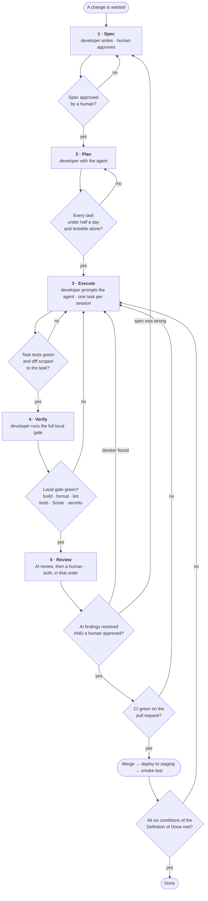
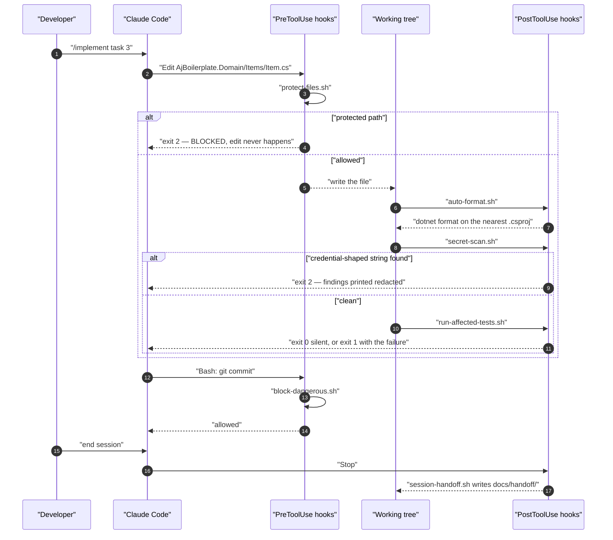
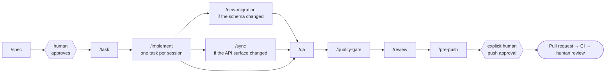
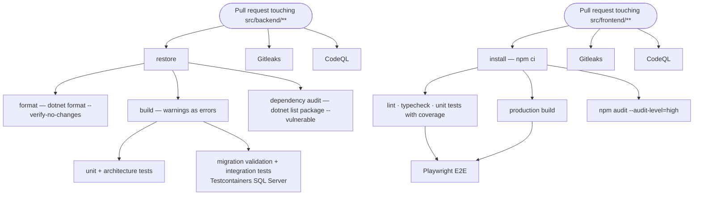

# The five-stage workflow

Every change — a bug fix, a feature, a refactor — moves through the same five stages:

**Spec → Plan → Execute → Verify → Review**

The stages exist to put the thinking before the typing and the checking before the merging. They
are proportional: a one-line fix spends thirty seconds in Spec and Plan, not thirty minutes. What
is *not* proportional is skipping Verify or Review — those are fixed costs on every change.

This document has three parts:

1. **[The process](#the-process-at-a-glance)** — the five stages, who owns each, and where work
   loops back.
2. **[The agentic harness](#the-agentic-harness)** — how `.claude/` participates: which command
   starts each stage, which agent does the work, which hooks fire, and which gates are
   deterministic rather than a matter of judgement.
3. **[A worked example](#worked-example-adding-owneremail-to-item)** — one small feature followed
   through all five stages, with the commands you actually type and the output you actually get
   back. Each stage below ends with its slice of that example.

For the layer-by-layer map of what you are changing, read
[architecture.md](architecture.md) alongside this.

---

## The process at a glance



Note where the loops go. A failing gate sends you back to **Execute**, not forward with a
follow-up ticket. A review finding that the *spec* was wrong sends you all the way back to
**Spec** — that is the cheap outcome, not the embarrassing one.

| Stage | Owner | Command | Output |
|---|---|---|---|
| 1 · Spec | developer, approved by a human reviewer | `/spec` | `docs/specs/YYYY-MM-DD-<slug>.md`, status `Approved` |
| 2 · Plan | developer, with the agent | `/task` | an ordered task list, each ≤ half a day |
| 3 · Execute | developer, prompting the agent | `/implement` | working code with tests, committed |
| 4 · Verify | developer | `/qa`, then `/pre-push` | a green local gate, with pasted evidence |
| 5 · Review | an AI reviewer **and** a human | `/review`, then a human | an approved, merged pull request |

---

## The agentic harness

`.claude/` ships committed, not gitignored, so every developer and every agent gets the same
rules. It has four kinds of thing in it, and the difference between them is the whole point of the
design:

```mermaid
flowchart LR
  subgraph P["PROBABILISTIC — judgement, may vary run to run"]
    STD["standards/ · 22 files<br/>what good looks like"]
    CMD["commands/ · 9 slash commands<br/>the procedure to follow"]
    AGT["agents/ · 9 subagents<br/>who does which kind of work"]
    WF["workflows/ · 7 procedures<br/>the long-form reasoning"]
    TPL["templates/ · 6 starting points"]
  end

  subgraph D["DETERMINISTIC — fires every time, identical every time"]
    HOOK["hooks/ · 8 shell scripts<br/>exit 2 blocks the tool call"]
    PERM["settings.json permissions<br/>deny · ask · allow"]
    CI["GitHub Actions<br/>backend-ci · frontend-ci · deploy"]
    ARCH["architecture tests<br/>compiled-reference assertions"]
  end

  P -. "prose an agent may misread,<br/>skip, or rationalise around" .-> D
  D --> OUT(["What actually reaches main"])
```



**Everything on the left is advice.** A standard is a document; an agent reads it, usually follows
it, and occasionally does not. That is not a defect of this repository — it is what a language
model is. Prose scales the *quality* of the default behaviour; it cannot be the last line of
defence.

**Everything on the right fires regardless.** A hook is a shell script the harness executes; it
does not read the room, get tired, or decide the rule does not apply this time. A CI job either
passes or does not. `DependencyRuleTests` inspects compiled assembly references, so a violation
cannot be argued with.

The design rule that follows, quoted from `.claude/README.md`: *"If it is worth enforcing
deterministically, it belongs in a hook, not only in prose. A rule a machine can check should not
depend on an agent remembering it."*

### The hooks, and exactly when they fire

Eight hooks are wired in `.claude/settings.json`. They degrade gracefully when a tool is missing
and are safe to run by hand.

| Hook | Event | Blocks? | What it does |
|---|---|:--:|---|
| `model-routing.sh` | UserPromptSubmit — **every prompt** | never | Injects the model-routing policy straight into context. `UserPromptSubmit` stdout is one of the few hook outputs the model actually reads, so this turns a linked markdown file from advisory into something said out loud on every turn. Dependency-free; always exits 0. |
| `block-dangerous.sh` | PreToolUse `Bash` | **yes — exit 2** | Refuses `rm -rf`, `git push --force`, `git reset --hard`, `git clean -fdx`, history rewriting, `DROP DATABASE` / `TRUNCATE` / `DROP TABLE`, production connection strings, production cloud operations, `terraform apply`/`destroy`, and credential-exfiltration shapes. **No bypass variable exists.** |
| `sonar-pre-push.sh` | PreToolUse `Bash`, only when the command is a `git push` | **yes — exit 2** | Queries the SonarQube quality gate and the open Blocker/Critical/Major list. Blocks while any is open, printing them. **Fails closed**: unreachable or unconfigured means the gate has not passed. |
| `protect-files.sh` | PreToolUse `Edit`\|`Write`\|`MultiEdit`\|`NotebookEdit` | **yes — exit 2** | Refuses edits to `.env*` (templates excepted), `appsettings.Production.json`, **already-existing** EF Core migrations and the model snapshot, `infra/*/prod/**`, `.claude/settings.json`, and key material. **No bypass variable exists.** |
| `auto-format.sh` | PostToolUse `Edit`\|`Write`\|… | no | Formats **only** the file just edited. `.cs` → `dotnet format` scoped to the nearest `.csproj`; `.ts/.html/.scss/.css/.json/.md` → Prettier, plus `eslint --fix` for TypeScript. A missing tool is a skip, never an error. |
| `secret-scan.sh` | PostToolUse `Edit`\|`Write`\|… (and usable as a git pre-commit hook) | **yes — exit 2** | Gitleaks on the changed file when installed, **plus** a built-in pattern set that always runs — PEM blocks, cloud keys, GitHub/Slack/Sonar tokens, JWTs, and connection strings carrying a password. Findings print redacted. |
| `run-affected-tests.sh` | PostToolUse `Edit`\|`Write`\|… | no — exit 1 on failure | Runs the touched project's tests immediately: `dotnet test` for `.cs`, `nx test` for `.ts`. **Never exits 2** — it surfaces a failure as a warning without cancelling the edit. Silent when nothing is affected. |
| `session-handoff.sh` | Stop | never | Writes `docs/handoff/<date>-<session>.md` from `git status` and `git diff --stat` — no model call — and flags when `CLAUDE.md`, `docs/adr/`, or the OpenAPI snapshot look stale relative to what changed. Reports only. |

Here is one ordinary edit, end to end:



Two details worth internalising. First, a **PreToolUse** hook can stop the tool call before it
happens; a **PostToolUse** hook can only react to something that already happened. That is why
`protect-files.sh` guards paths (prevention) while `secret-scan.sh` scans content (detection) —
and why a secret finding is an incident, not a warning: the value already reached a file, so it is
compromised and must be rotated. Second, `run-affected-tests.sh` deliberately never blocks. A red
test during TDD is the *expected* state; a hook that cancelled the edit would make test-first
impossible.

### The permission layer

`.claude/settings.json` also carries a three-tier permission policy, which is deterministic in the
same way:

- **`deny`** — never, no prompt: `rm -rf`, any force push, `git reset --hard`, `terraform
  apply`/`destroy`, `kubectl delete`, reading `.env*` / `*.pem` / `~/.ssh/**` / cloud credential
  directories, editing `appsettings.Production.json`, `infra/*/prod/**`, or `.claude/settings.json`.
- **`ask`** — always prompts a human: `git push`, `gh pr create`, `gh pr merge`, `gcloud`, `az`,
  `npm publish`, `dotnet ef database update`.
- **`allow`** — no prompt, because they are safe and constant: the `dotnet` build/test/format
  commands, `npm`/`npx nx`, read-only git, and ordinary file inspection.

Note that `git push` appears in **`ask`** *and* is separately gated by `sonar-pre-push.sh`. Those
are two independent controls: the hook decides whether the code has passed the gate, the permission
prompt decides whether a human has agreed to publish it.

### Which agent does what

Nine subagent definitions live in `.claude/agents/`. They are prose — descriptions of a role and
the standards it must apply — so an agent is a way of *loading the right context*, not a sandbox.

| Agent | Stage it serves | Role |
|---|---|---|
| `master-agent` | all | Orchestrator: plans, routes to specialists, enforces the non-negotiables |
| `backend-agent` / `backend-engineer` | 3 | .NET, Clean Architecture, EF Core, SQL Server |
| `frontend-agent` / `frontend-engineer` | 3 | Angular, Nx, PrimeNG, standalone + signals, generated types |
| `test-engineer` | 3 | Unit, integration, architecture, component, E2E, accessibility tests |
| `code-reviewer` | 5 | Reviews the diff against boundaries, standards, correctness, security |
| `security-auditor` | 5 | OWASP baseline, SSO, scoped tokens, field-level confidentiality, secrets, audit log |
| `quality-gate` | 4 | Runs build, test, lint, SonarQube and certifies readiness; never pushes |

### Which command starts each stage



**No command in this harness pushes.** `/qa`, `/quality-gate`, `/review`, and `/pre-push` all end
by reporting and stopping. Pushing is a decision a human makes, every time, on every branch and
every remote.

### The CI gates

CI is the second deterministic layer, and it does not care what any agent believed.



Both workflows are path-filtered, so a backend-only change does not run the frontend suite. Both
run on `pull_request` and on `push` to `main` — **except the SonarQube job in each, which is
guarded to `push` on `main` only.** That guard is a Community Edition consequence, explained
[below](#a-note-on-sonarqube-community-edition); the two stacks analyse under separate project
keys (`SONAR_PROJECT_KEY` and `SONAR_PROJECT_KEY_FRONTEND`) so one does not overwrite the other.

Deployment is a separate workflow. `deploy.yml` chains `dev → staging → prod`, each calling the
reusable `deploy-environment.yml`. **The approval gate is GitHub's own environment protection
rules** — create `dev`, `staging`, and `prod` under *Settings → Environments* and add required
reviewers to `staging` and `prod`. Without those rules the workflow promotes straight to
production unreviewed.

### A note on SonarQube: Community Edition

The SonarQube used here is the **free Community Edition**. That has a specific, load-bearing
consequence:

> **Community Edition has no pull-request decoration and no branch analysis.** It analyses one
> branch — the main branch — and that is all. There will be no Sonar comment on your pull request,
> no per-branch quality gate, and no "new code on this branch" view.

What that means in practice:

- **The CI quality gate is a main-branch gate.** The Sonar job in both workflows is guarded to run
  only on a `push` to `main`, precisely because every Community Edition analysis lands on the
  project's single default branch — running it from a pull request would overwrite the dashboard
  with code that is not on `main`. Treat it as the post-merge check that the trunk is still
  healthy, not as something that can block your PR the way a decorated gate would.
- **The local gate is where Sonar actually protects you.** `/qa`, `/quality-gate`, `/pre-push`,
  and the `sonar-pre-push.sh` hook all run before anything leaves your machine. `sonar-pre-push.sh`
  fails closed — an unreachable or unconfigured server counts as "not passed" — so the enforcement
  is real even without PR decoration.
- **Do not promise decoration in a PR template or a runbook.** If you later move to an edition that
  supports branch analysis, add it deliberately; until then, the honest description is the one
  above.
- The gate's own thresholds are unchanged either way: **zero new Blocker, Critical, or Major
  findings**, and **≥80% coverage on new code**. Minor and Info may be triaged, with the triage
  recorded.

Configuration lives in `SONAR_HOST_URL`, `SONAR_TOKEN`, and `SONAR_PROJECT_KEY` — environment
variables locally, repository variables and secrets in CI. Never committed.

---

## Worked example: adding `ownerEmail` to `Item`

One small, realistic change followed through all five stages. It is deliberately unglamorous: an
optional `ownerEmail` on the sample `Item`, shown in the list and editable on the form. It touches
the contract, the schema, the domain, the API, the generated types, the UI, and a journey — which
is exactly why it is a good first exercise.

Every command below is real, and every path exists in this repository.

---

## Stage 1 — Spec

**Owner:** the developer, reviewed and approved by the tech lead
**Output:** `docs/specs/YYYY-MM-DD-<slug>.md`, status `Approved`
**Command:** `/spec`
**Hooks that fire:** `protect-files.sh` (Pre), `auto-format.sh` + `secret-scan.sh` (Post) on the
spec file itself

Write down the problem, the acceptance criteria as Given/When/Then, the API contract, the data
model change, the UI states, the test plan, and — explicitly — what is out of scope. Use
[the template](specs/TEMPLATE.md); keep every heading, and write "None" where a section genuinely
does not apply so a reader can tell *considered and empty* from *forgotten*.

`/spec` will ask the questions that change the design before it starts drafting — the actor, the
trigger, the data, the rules, what happens when it fails. Answer them. Then it stops: **a spec is
approved by a human, not by the agent that wrote it.**

Nothing is built until the spec is approved. This is the cheapest stage to be wrong in, and the
only one where being wrong costs nothing.

**Done when:** a second person can read the spec and independently describe what will be built,
and every open question in §8 is closed.

### Worked example — Stage 1

You type:

```
/spec item-owner-email
```

The agent asks the load-bearing questions ("is it required?", "who may see it?", "is it personal
data?"), then writes `docs/specs/2026-08-11-item-owner-email.md`. Trimmed to the sections that
carry the decisions:

```markdown
# Spec: Item owner email

**Status:** Approved
**Author:** <you>
**Reviewer:** <a human, always>

## 1. Problem statement

**Today:** an item records no point of contact, so when a question arises about one there is no
way to tell from the record who to ask.

**Success looks like:** any item can carry an optional owner email address, visible in the list
and editable on the form.

## 2. Acceptance criteria

| # | Criterion |
|---|---|
| AC-1 | **Given** an existing item **When** an editor saves it with `ownerEmail` set to a valid address **Then** the API returns `200` and the stored item carries that address |
| AC-2 | **Given** an existing item **When** an editor saves it with `ownerEmail` omitted or blank **Then** the API returns `200` and the stored value is `null` |
| AC-3 | **Given** any item **When** a request sends `ownerEmail` that is not a valid address **Then** the API returns `400` with code `VALIDATION_ERROR` and no state changes |
| AC-4 | **Given** an item edited by someone else since it was read **When** an editor saves with a stale `rowVersion` **Then** the API returns `409` with code `CONFLICT` and `ownerEmail` is unchanged |
| AC-5 | **Given** a viewer **When** they open the item list **Then** the owner email column is visible and no edit control is offered |

## 3. API contract

| Method | Route | Auth | Success | Change |
|---|---|---|---|---|
| `GET` | `/api/v1/items` | `ReadAccess` | `200` `PagedResponse<ItemResponse>` | `ItemResponse` gains `ownerEmail` |
| `GET` | `/api/v1/items/{id}` | `ReadAccess` | `200` `ItemResponse` | as above |
| `POST` | `/api/v1/items` | `WriteAccess` | `201` + `Location` | `CreateItemRequest` gains optional `ownerEmail` |
| `PUT` | `/api/v1/items/{id}` | `WriteAccess` | `200` | `UpdateItemRequest` gains optional `ownerEmail` |

**Delta, in `AjBoilerplate.Contracts.Items`:**

```csharp
// ItemResponse: one new trailing member, nullable
public sealed record ItemResponse(
    Guid Id, string Name, string? Description, string Status,
    DateTimeOffset CreatedAt, DateTimeOffset? UpdatedAt, string RowVersion,
    string? OwnerEmail);

// CreateItemRequest / UpdateItemRequest: one new optional member
public sealed record CreateItemRequest(string Name, string? Description, string? Status, string? OwnerEmail);
public sealed record UpdateItemRequest(string Name, string? Description, string Status, string RowVersion, string? OwnerEmail);
```

**Error codes:** no new codes. An invalid address reuses `VALIDATION_ERROR`; the concurrency
conflict reuses `CONFLICT`. Both are already in `EnvelopeCodes`.

**Breaking-change check:** additive only — one new nullable field on the response, one new
optional field on each request. No field removed, renamed, or narrowed; no status code changed.
No new API version needed.

## 4. Data model changes

`Items` gains `OwnerEmail NVARCHAR(320) NULL`. No index — nothing queries by it yet. Migration
`AddItemOwnerEmail`, reversible, no backfill, no downtime.

**Retention and privacy:** this is personal data. It is deleted with the item; it is never
logged, and it does not appear in any audit payload.

## 7. Out of scope

- Filtering or searching the list by owner email.
- Notifying the owner of anything.
- Validating that the address belongs to a real directory user.
```

The human reviewer approves it. Only now does Stage 2 start.

---

## Stage 2 — Plan

**Owner:** the developer, with the agent
**Output:** an ordered task list, each task independently testable and mergeable
**Command:** `/task <path-to-approved-spec>`

Break the spec into tasks. A good task is one sitting's work, has an observable outcome, and can
be verified on its own. If a task cannot be tested independently, it is two tasks or it is
underspecified. `/task` refuses to run against a spec that has not been approved.

Two rules it enforces:

1. **Each task is at most half a day.** Oversized tasks produce oversized diffs, and oversized
   diffs are not reviewed, they are skimmed.
2. **Each task is independently mergeable.** It builds, its tests pass, and merging it alone
   leaves `main` working.

And one ordering, which is the order that keeps the tree green at every step:

> **Contracts & DTOs → Migrations → Domain → Application → API → Frontend data-access → UI → E2E**

Anything that cannot be placed in that order is a signal the spec is incomplete.

Decide here what needs an ADR. If the plan contains a decision that is expensive to reverse, write
the ADR now — not after the code makes the decision for you.

**Done when:** the task list is ordered, each task names the tests that will prove it, and the
estimated diff for each is small enough to review.

### Worked example — Stage 2

You type:

```
/task docs/specs/2026-08-11-item-owner-email.md
```

You get back eight tasks in the prescribed order. Every path is written in full, relative to the
repository root, so it can be copied straight into an editor:

**1 · Add `OwnerEmail` to the item DTOs** — depends on nothing.
`src/backend/src/AjBoilerplate.Contracts/Items/ItemContracts.cs`
→ `dotnet build src/backend/AjBoilerplate.slnx -warnaserror`

**2 · Add the `AddItemOwnerEmail` migration** — depends on task 3.
`src/backend/src/AjBoilerplate.Infrastructure/Persistence/Configurations/ItemConfiguration.cs`,
plus a new file under `src/backend/src/AjBoilerplate.Infrastructure/Persistence/Migrations/`
→ `dotnet test src/backend/tests/AjBoilerplate.IntegrationTests`

**3 · Carry `OwnerEmail` on the `Item` entity, normalised and bounded** — depends on nothing.
`src/backend/src/AjBoilerplate.Domain/Items/Item.cs`
→ `dotnet test src/backend/tests/AjBoilerplate.UnitTests --filter "FullyQualifiedName~ItemTests"`

**4 · Thread `OwnerEmail` through the commands, service, and validators** — depends on task 3.
`src/backend/src/AjBoilerplate.Application/Items/ItemModels.cs`,
`src/backend/src/AjBoilerplate.Application/Items/ItemService.cs`,
`src/backend/src/AjBoilerplate.Application/Items/ItemValidators.cs`
→ `dotnet test src/backend/tests/AjBoilerplate.UnitTests --filter "FullyQualifiedName~Items"`

**5 · Map `OwnerEmail` in the controller and document it in OpenAPI** — depends on tasks 1 and 4.
`src/backend/src/AjBoilerplate.Api/Controllers/ItemsController.cs`
→ `dotnet test src/backend/tests/AjBoilerplate.IntegrationTests --filter "FullyQualifiedName~ItemsApiTests"`

**6 · Regenerate the API types and extend the typed service** — depends on task 5.
`src/frontend/libs/data-access/api-types/src/lib/types.ts` (generated),
`src/frontend/libs/data-access/api-client/src/lib/items-api.service.ts`
→ `cd src/frontend && npm run typecheck`

**7 · Show and edit the field in the item list and form** — depends on task 6.
`src/frontend/libs/feature-items/src/lib/item-list-page/`,
`src/frontend/libs/feature-items/src/lib/item-form-page/`
→ `cd src/frontend && npx nx test feature-items`

**8 · Extend the CRUD journey to cover the new field** — depends on task 7.
`src/frontend/apps/web-e2e/src/journeys/items-crud.spec.ts`
→ `cd src/frontend && npx nx run web-e2e:e2e`

Note tasks 1 and 3 have no dependencies, so they can run in parallel. Note also that the migration
(2) depends on the domain change (3) rather than the other way round: **the migration is generated
from the model, never hand-authored to lead it.** No ADR is needed here — nothing about this
change is expensive to reverse.

---

## Stage 3 — Execute

**Owner:** the developer, prompting the agent
**Output:** working code with tests, committed
**Command:** `/implement <task>`
**Hooks that fire on every edit:** `protect-files.sh` before; `auto-format.sh`, `secret-scan.sh`,
`run-affected-tests.sh` after

**Test first, always.** Write the failing test. Watch it fail — a test that has never failed has
not been shown to test anything. Then write the minimum code that makes it pass. Then refactor
with the test green.

One task per session. Fresh context for each task. When a task is done, the session ends.

`/implement` works on a branch, never `main`, and finishes by summarising what it did, what it
verified **with the actual command output**, and what is still open. It does not push.

**Done when:** the task's tests pass, the affected suites still pass, and the diff contains
nothing the task did not require.

### Worked example — Stage 3

Take **task 3**, the domain change. Start a fresh session:

```
/implement task 3 from docs/specs/2026-08-11-item-owner-email.md — carry OwnerEmail on the Item entity
```

**First, the failing test.** The agent adds to
`src/backend/tests/AjBoilerplate.UnitTests/Items/ItemTests.cs`:

```csharp
[Fact]
public void Create_trims_and_lowercases_the_owner_email()
{
    var item = Item.Create(Guid.NewGuid(), "Widget", null, ItemStatus.Draft, Now, "  Owner@Example.COM ");

    Assert.Equal("owner@example.com", item.OwnerEmail);
}

[Fact]
public void Create_treats_a_blank_owner_email_as_absent()
{
    var item = Item.Create(Guid.NewGuid(), "Widget", null, ItemStatus.Draft, Now, "   ");

    Assert.Null(item.OwnerEmail);
}
```

`auto-format.sh` fires the moment the file is written and runs `dotnet format` scoped to
`AjBoilerplate.UnitTests.csproj`. `secret-scan.sh` fires next — `owner@example.com` matches its
placeholder allowance (`example.com`), so it passes silently. `run-affected-tests.sh` fires last
and runs the unit project:

```
$ dotnet test src/backend/tests/AjBoilerplate.UnitTests --filter "FullyQualifiedName~ItemTests"

error CS1501: No overload for method 'Create' takes 6 arguments
```

Good — it fails, and it fails for the right reason. This is the state a hook must not cancel,
which is exactly why `run-affected-tests.sh` exits 1 rather than 2.

**Then the implementation.** `src/backend/src/AjBoilerplate.Domain/Items/Item.cs` gains the
constant, the property, the factory parameter, and the normaliser — with the invariant inside the
entity, where it belongs:

```csharp
/// <summary>Maximum length of <see cref="OwnerEmail"/>; the RFC 5321 limit.</summary>
public const int MaxOwnerEmailLength = 320;

public string? OwnerEmail { get; private set; }

private static string? NormalizeOwnerEmail(string? ownerEmail)
{
    var trimmed = ownerEmail?.Trim().ToLowerInvariant();
    if (string.IsNullOrEmpty(trimmed))
    {
        return null;
    }

    if (trimmed.Length > MaxOwnerEmailLength)
    {
        throw new DomainException($"An item's owner email cannot exceed {MaxOwnerEmailLength} characters.");
    }

    return trimmed;
}
```

Run it again. `ItemTests` ships with 15 facts, so the two you just added take it to 17:

```
$ dotnet test src/backend/tests/AjBoilerplate.UnitTests --filter "FullyQualifiedName~ItemTests"

Passed!  - Failed: 0, Passed: 17, Skipped: 0, Total: 17
```

**Then task 2, the migration.** The model changed first, so now the migration can be generated
from it. From `src/backend`:

```bash
dotnet ef migrations add AddItemOwnerEmail \
  --project        src/AjBoilerplate.Infrastructure \
  --startup-project src/AjBoilerplate.Api \
  --output-dir     Persistence/Migrations
```

Prefer `/new-migration AddItemOwnerEmail`, which runs the same command and then walks the by-hand
review checklist in `.claude/templates/ef-migration.md` before anything is applied. Read the
generated `Up()` and `Down()` yourself — look for an unintended `DropColumn`, a type change that
forces a table rebuild, a new non-nullable column with no default.

Applying it prompts, because `dotnet ef database update` is on the **`ask`** list in
`.claude/settings.json`:

```bash
dotnet ef database update \
  --project        src/AjBoilerplate.Infrastructure \
  --startup-project src/AjBoilerplate.Api
```

Two things the harness will stop you doing here, deterministically:

- Editing the migration you generated last week — `protect-files.sh` blocks any write to an
  existing file under `*/Migrations/*` or to `AppDbContextModelSnapshot.cs`. Fix forward with a
  new migration.
- Reaching for `TRUNCATE` or `DROP TABLE` to reset your local database — `block-dangerous.sh`
  blocks both, with no bypass.

**Then task 6, the contract sync.** With the API running:

```bash
cd src/frontend
npm run generate:api
```

That rewrites `libs/data-access/api-types/src/lib/types.ts` from the live OpenAPI document. The
diff in that file is the review signal that a contract moved. Never hand-edit it; if the output is
wrong, the annotation on the server is wrong.

Commit after each task. `git commit` is on the **`allow`** list, so it does not prompt —
committing is routine, publishing is not.

---

## Stage 4 — Verify

**Owner:** the developer
**Output:** a green local gate, with evidence
**Commands:** `/qa`, then `/pre-push`

Run the full gate locally before asking anyone else to look at the work:

- Build with warnings as errors — a warning is a failure.
- `dotnet format --verify-no-changes`, ESLint, Prettier.
- Unit, integration, and architecture tests.
- The quality gate: zero new Blocker, Critical, or Major findings; ≥80% coverage on new code.
- Playwright, if a user journey changed.

Paste the evidence into the pull request. "It works" is not evidence; the command output is.

If the gate is red, it is not "nearly done". It is not done.

**Done when:** every gate is green locally and the output is in the pull request.

### Worked example — Stage 4

You type `/qa`. It runs the backend, then the frontend, then the secret scan, then Sonar, and
prints each step's **real** result rather than a summary of what it expected. By hand, the same
sequence is:

```bash
# --- backend -------------------------------------------------------------
dotnet build  src/backend/AjBoilerplate.slnx -warnaserror
dotnet format src/backend/AjBoilerplate.slnx --verify-no-changes
dotnet test   src/backend/tests/AjBoilerplate.UnitTests
dotnet test   src/backend/tests/AjBoilerplate.ArchitectureTests
dotnet test   src/backend/tests/AjBoilerplate.IntegrationTests    # needs Docker
dotnet list   src/backend/AjBoilerplate.slnx package --vulnerable --include-transitive

# --- frontend ------------------------------------------------------------
cd src/frontend
npm run lint
npm run typecheck
npm run test
npm run build
npx nx run web-e2e:e2e            # a journey changed, so this runs
npm audit --audit-level=high

# --- secrets -------------------------------------------------------------
gitleaks detect --no-banner --redact
```

What you should see. The counts below are the suites **as this repository ships**, so you can run
these commands on a clean clone right now and compare — your own totals will be these plus whatever
tests your change added:

```
Build succeeded.
    0 Warning(s)
    0 Error(s)

Passed!  - Failed: 0, Passed: 88, Skipped: 0, Total: 88   (UnitTests)
Passed!  - Failed: 0, Passed:  9, Skipped: 0, Total:  9   (ArchitectureTests)
Passed!  - Failed: 0, Passed: 29, Skipped: 0, Total: 29   (IntegrationTests)

  6 passed                                                (Playwright: 2 journey + 4 accessibility)

no leaks found                                            (Gitleaks)
```

Those nine architecture tests are the six dependency rules plus the three controller conventions —
see [architecture.md](architecture.md#the-dependency-rule-and-the-tests-that-enforce-it). If any of
them ever fails, the fix is to move the type that leaked across the boundary, not to relax the
test.

Then `/pre-push`. It re-checks the tree is committed, re-runs the gate, reads the SonarQube result
through the SonarQube MCP server (`get_project_quality_gate_status`, then
`search_sonar_issues_in_projects` filtered to `BLOCKER,CRITICAL,MAJOR`, then
`search_security_hotspots`), and confirms the documentation caught up with the code — the OpenAPI
snapshot in `docs/api/`, any new ADR, and `CLAUDE.md` if a convention changed.

```
Quality gate: OK
Open Blocker/Critical/Major: 0
Coverage on new code: 91.4%
Readiness: green — push requires your explicit approval.
```

Remember what that gate is and is not: with **Community Edition** there is no branch analysis, so
this reads the project's main-branch analysis. The local run is where it protects you. If you now
try to push before that gate is green, `sonar-pre-push.sh` blocks the `git push` outright:

```
BLOCKED by .claude/hooks/sonar-pre-push.sh

3 open Blocker/Critical/Major issue(s) on project "your-project-key".
Every one of them must be fixed before this push.
```

And if SonarQube is simply not running, it still blocks — the gate fails closed, because "could
not evaluate" is not "passed".

---

## Stage 5 — Review

**Owner:** an AI reviewer *and* a human reviewer — both, in that order
**Output:** an approved, merged pull request
**Commands:** `/review`, then a human

`/review` first: it reads `git diff` and `git diff --staged` — the diff, not its memory of what it
intended to write — checks the change against the spec, walks the checklist in
`.claude/workflows/code-review.md`, and cross-checks the standards for access control and OWASP,
API contract and versioning, middleware order, error handling, EF Core and migrations, the
frontend rules, and test coverage of every new behaviour, error path, and authorization rule. It
outputs prioritised findings with `file:line`, each marked **blocker** or **nit**. Fix what it
finds before a human spends time on it.

Then a human reviews every line. Not a skim, not a rubber stamp.

**Human review is mandatory and is never waived because an agent wrote the code.** If anything,
agent-written code needs *more* attention: it is fluent, confident, plausible, and consistently
formatted, which makes a wrong approach look exactly like a right one. Reviewers should be most
careful precisely where the code reads most smoothly.

Read [the Definition of Done](definition-of-done.md) before approving. All six conditions, or it
does not merge.

**Done when:** both reviews are approved, the Definition of Done is met, and there are no open
critical or major findings.

### Worked example — Stage 5

You type `/review`. On this change it might come back with:

```
BLOCKER  src/backend/src/AjBoilerplate.Application/Items/ItemValidators.cs:41
         UpdateItemCommandValidator has no rule for OwnerEmail. AC-3 requires a 400 with
         VALIDATION_ERROR for a malformed address; today it reaches the domain and either
         persists or surfaces as a 500. Add an EmailAddress rule bounded by
         Item.MaxOwnerEmailLength, and a unit test per AC-3.

BLOCKER  src/frontend/libs/feature-items/src/lib/item-form-page/item-form-page.ts:78
         The ownerEmail control is not included in the UpdateItemRequest body, so an edit
         silently discards the field. Covered by no test — AC-1 has no frontend assertion.

NIT      src/backend/src/AjBoilerplate.Domain/Items/Item.cs:31
         MaxOwnerEmailLength is documented as "the RFC 5321 limit" — worth naming the RFC in
         the spec too, so the number is traceable rather than folkloric.
```

You fix the two blockers, re-run `/qa`, and open the pull request. The body follows
`.claude/templates/pull-request.md`, which is a checklist rather than a narrative:

- **Summary** — what changed and why, linking `docs/specs/2026-08-11-item-owner-email.md`
- **Changes** — backend layers touched and the migration added; frontend libraries and whether
  types were regenerated; docs and infra
- **Quality gate** — a checkbox per command, with the pasted output: build clean with warnings as
  errors, `dotnet format` clean, `dotnet test` green across all three suites, the frontend targets
  clean, Playwright green and axe clean on changed screens, SonarQube at zero
  Blocker/Critical/Major with ≥80% coverage on new code, Gitleaks clean, migration reviewed
- **Architecture & standards** — Clean Architecture and Nx boundaries respected; standalone +
  OnPush + signals + `inject()`; PrimeNG only; no hand-written HTTP client or duplicated DTO; no
  `any`, no `EnsureCreated`, no manual DDL
- **API contract** — versioned route, envelope with `traceId`, correct status codes, OpenAPI
  documented and frontend types regenerated
- **Security** — deny-by-default policy, ownership validated after load, restricted fields removed
  by DTO projection, no secrets or real identifiers
- **Notes / risks** — what a reviewer should look at hardest

Then, and only then, you ask for push approval. `git push` prompts because it is on the **`ask`**
list; `sonar-pre-push.sh` runs first and either lets it through or blocks it.

**What the human reviewer owns**, and no tool can do for them:

- **Is this the right change at all?** The gate proves the code is well-formed; it says nothing
  about whether the feature should exist.
- **Does it match the spec, including the non-goals?** Scope creep is invisible to a linter.
- **Are the tests testing anything?** An assertion that agrees with whatever the code does is not
  a test. Ask whether each one was ever seen failing.
- **Is the concurrency and error behaviour right in the cases nobody wrote a test for?**
- **Can the author explain every line?** If not, it does not merge — see the guardrail below.

The human review is also where a wrong *spec* gets caught, which loops the change all the way back
to Stage 1. That is the cheapest place this can end.

---

## Guardrails

These are not suggestions. They exist because each one has a specific failure it prevents.

### One task per session, fresh context per task

Long sessions accumulate stale context: superseded decisions, abandoned approaches, half-finished
edits. The agent then reasons from a mix of what is true and what used to be true. Start each
task clean.

### Test-driven, genuinely

The failing test comes first and you watch it fail. This is the difference between testing your
code and writing code that agrees with your test. It matters more with an agent, not less — an
agent asked for code and tests together will produce tests that pass against whatever it wrote.

### No unattended multi-hour runs

Never leave an agent running unsupervised for hours. Without a human in the loop, a small wrong
turn compounds into a large one, and by the time you look the diff is unreviewable and the
context that produced it is gone. Stay present, review at each task boundary.

### Roughly 400 changed lines per pull request

A reviewer's attention is finite and measurable, and it falls off a cliff well before a
thousand-line diff. Above roughly 400 changed lines, review quality degrades into
pattern-matching. Split the work. Generated files (`api-types`, migrations) are excluded from
the count — but they are still reviewed.

### The prompting developer owns the code

You wrote it. Not the agent — you. You are accountable for its correctness, its security, its
performance, and its maintenance. "The AI generated it" explains nothing and excuses nothing. If
you cannot explain a line in review, it does not merge.

### Never push without explicit human approval

Committing is routine. Pushing is a decision a human makes, every time, on every branch and
every remote. This is enforced twice: `git push` sits in the `ask` list in
`.claude/settings.json`, and `sonar-pre-push.sh` independently blocks the push until the gate is
green.

### Secrets never enter context

No credential, connection string, token, or key in a prompt, a file, a commit message, a spec,
or an ADR. Ever. Rotate anything that leaks. `secret-scan.sh` catches what it can, but treat a
finding as an incident rather than a warning: the value already reached a file.

### Documentation moves with the change

If a convention changed, `CLAUDE.md` changes in the same pull request. If a decision was made, an
ADR lands with it. If a contract changed, the OpenAPI document and the generated types change
with it. Documentation that lags is documentation that misleads. `session-handoff.sh` flags this
drift at the end of every session — do not ignore its report.

### Improve the harness, not just the code

Once a week, look at where an agent got it wrong and ask the only question that matters: *what
change would have prevented this?* Then pick exactly one home for the fix — `CLAUDE.md` or a
standard if it did not know the rule, a command workflow if it skipped a step, an agent
description if the wrong specialist was used, **a hook if the thing should have been impossible**.
The full practice is written up in `.claude/README.md`. Prefer a hook to a paragraph: prose is
advisory, a hook is deterministic.

---

## Commands

| Command | Stage | What it does |
|---|---|---|
| `/spec` | 1 | Start a spec from the template; stops for human approval |
| `/task` | 2 | Break an approved spec into ≤half-day, independently-mergeable tasks |
| `/implement` | 3 | Implement one task, test-first, on a branch |
| `/new-migration` | 3 | Create an EF Core migration, review it by hand, then apply and script it |
| `/sync` | 3 | Regenerate API types from OpenAPI and check for duplicated DTOs and unversioned calls |
| `/qa` | 4 | The full local gate |
| `/quality-gate` | 4 | Static analysis only, enforcing zero Blocker/Critical/Major |
| `/pre-push` | 4 | The gate plus a readiness report — never pushes |
| `/review` | 5 | AI review of the diff |

Each has a longer-form procedure behind it in `.claude/workflows/` — read the workflow when you
want the reasoning, run the command when you want the work done.

---

## Where to look next

| Topic | Path |
|---|---|
| What each layer is for, and why the boundaries exist | [architecture.md](architecture.md) |
| What "done" means — all six conditions | [definition-of-done.md](definition-of-done.md) |
| Day-1 checklist | [onboarding.md](onboarding.md) |
| The spec template | [specs/TEMPLATE.md](specs/TEMPLATE.md) |
| Why each decision was made | [adr/](adr/) |
| The API contract procedure | [api/README.md](api/README.md) |
| Session handoffs written by the Stop hook | [handoff/](handoff/) |
| The harness in full — hooks, agents, standards, escape hatches | [../.claude/README.md](../.claude/README.md) |
